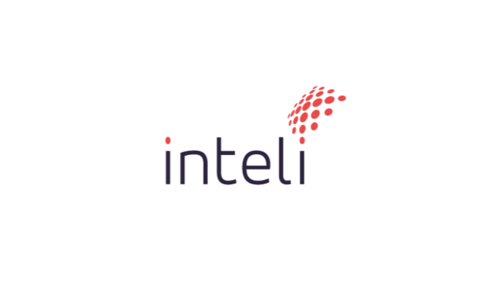

# Inteli - Instituto de Tecnologia e Liderança 

# Ad Alma 

## :student: Integrantes:
- <a href="https://www.linkedin.com/search/results/all/?fetchDeterministicClustersOnly=true&heroEntityKey=urn%3Ali%3Afsd_profile%3AACoAAEHg7KgBbPEcy1BuyW_qpWisfE8uVkKMRv4&keywords=ana%20%20clara%20madureira%20marques&origin=RICH_QUERY_SUGGESTION&position=3&searchId=4cfbe9c6-b213-4fd0-92d2-c5245361dac9&sid=vcv&spellCorrectionEnabled=false">Ana Clara</a>
- <a href="https://www.linkedin.com/in/guilherme-ferreira-linhares-8638411a1?utm_source=share&utm_campaign=share_via&utm_content=profile&utm_medium=android_app/">Guilherme Linhares</a>
- <a href="https://www.linkedin.com/in/gustavo-gouveia-583185271//">Gustavo Gouveia</a>
- <a href="https://www.linkedin.com/search/results/all/?fetchDeterministicClustersOnly=true&heroEntityKey=urn%3Ali%3Afsd_profile%3AACoAADWbQRkBGGIxCUc67t4AlSpxviPcr6a9a1w&keywords=josé%20vitor%20alencar&origin=RICH_QUERY_SUGGESTION&position=0&searchId=df4ac4df-9ded-40cd-98c9-f26f09503bbc&sid=9R3&spellCorrectionEnabled=false">José Alencar</a>
- <a href="https://www.linkedin.com/search/results/all/?fetchDeterministicClustersOnly=true&heroEntityKey=urn%3Ali%3Afsd_profile%3AACoAAEHeo4kBjhiblXY7EhuLEPzDFSqlZSoI79k&keywords=lucas%20de%20luccas&origin=RICH_QUERY_SUGGESTION&position=0&searchId=1812ff95-6724-4b55-b41d-fd4530966e32&sid=VAK&spellCorrectionEnabled=false">Lucas de Luccas</a>
- <a href="https://www.linkedin.com/in/luiza-rubim//">Luiza Rubim</a>
- <a href="https://www.linkedin.com/search/results/all/?fetchDeterministicClustersOnly=true&heroEntityKey=urn%3Ali%3Afsd_profile%3AACoAADjuXGwBDNYNEXmSa3WGWf65T4Svw9LeNaE&keywords=pedro%20henrique%20cruz&origin=RICH_QUERY_SUGGESTION&position=1&searchId=f483c77a-6226-4223-b96d-b200b630d99d&sid=U4n&spellCorrectionEnabled=false">Pedro Cruz</a>

## :teacher: Professores:

### Orientador(a)
-  <a href="https://www.linkedin.com/search/results/all/?fetchDeterministicClustersOnly=true&heroEntityKey=urn%3Ali%3Afsd_profile%3AACoAAAykOzQB5ysfrVBflYGsa1gMYs0FJzjP_Q0&keywords=murilo%20zanini%20de%20carvalho&origin=RICH_QUERY_SUGGESTION&position=1&searchId=1a090b1e-3dbf-4e77-b2c1-79b080c71e9d&sid=jqs&spellCorrectionEnabled=false/">Murilo Zanini</a>

### Instrutores
- <a href="https://www.linkedin.com/in/francisco-escobar/">Francisco Escobar</a>
- <a href="https://www.linkedin.com/search/results/all/?fetchDeterministicClustersOnly=true&heroEntityKey=urn%3Ali%3Afsd_profile%3AACoAAB2cyWMBr_qKQ9v7FgI2VD2Zs3MsZuvCWls&keywords=lisa%20valdo&origin=RICH_QUERY_SUGGESTION&position=0&searchId=6c817f2b-ccba-44f2-8d82-cf21c2bd30f3&sid=xdN&spellCorrectionEnabled=false
">Lisane Valdo</a>
- <a href="https://www.linkedin.com/search/results/all/?fetchDeterministicClustersOnly=true&heroEntityKey=urn%3Ali%3Afsd_profile%3AACoAAARM1cMB1KNgIAC39UCby3VMPokwsGQ9Y0o&keywords=geraldo%20magela%20severino%20vasconcelos&origin=RICH_QUERY_SUGGESTION&position=0&searchId=abd0e985-90e9-4362-abf9-239f84aa4367&sid=Aa%3B&spellCorrectionEnabled=false">Geraldo Magela Vasconcelos</a>
- <a href="https://www.linkedin.com/search/results/all/?fetchDeterministicClustersOnly=true&heroEntityKey=urn%3Ali%3Afsd_profile%3AACoAAAB7I-IBNmHc3IF8RSmca-Dh44B4MGyhmzM&keywords=monica%20anastassiu%2C%20d.sc.&origin=RICH_QUERY_SUGGESTION&position=0&searchId=3ee22c4f-6d83-43e1-aab3-0e8a1b60dc19&sid=Eho&spellCorrectionEnabled=false">Monica Anastassiu</a>
- <a href="https://www.linkedin.com/search/results/all/?fetchDeterministicClustersOnly=true&heroEntityKey=urn%3Ali%3Afsd_profile%3AACoAACW8FDsBL8WouQgmmjv2-18x72qItDwcXPA&keywords=rodrigo%20mangoni%20nicola&origin=RICH_QUERY_SUGGESTION&position=1&searchId=d9e33486-d158-440b-a604-561a735f32c0&sid=G_n&spellCorrectionEnabled=false">Rodrigo Mangoni Nicola</a>
- <a href="https://www.linkedin.com/search/results/all/?fetchDeterministicClustersOnly=true&heroEntityKey=urn%3Ali%3Afsd_profile%3AACoAAA3eu-MB2hs-oNjNOaeqmk3WnmUFdylsrUw&keywords=andré%20leal&origin=RICH_QUERY_SUGGESTION&position=1&searchId=837ec508-a4ef-43aa-b397-27b91464c193&sid=Ea%40&spellCorrectionEnabled=false">André Leal</a>

## 📝 Descrição

# Otimização da Bipagem de Carrinhos de Emergência através da Automação

O projeto em desenvolvimento visa aprimorar o processo de reposição e abastecimento dos carrinhos de emergência do Hospital Sírio Libanês. Atualmente, a reposição é realizada manualmente, o que, apesar de funcional, demonstra falta de eficiência, pois uma pessoa é responsável por todo o processo repetitivo, resultando em fadiga e possíveis falhas na verificação das informações dos itens.

Para resolver esses problemas, o projeto propõe a automatização do processo de bipagem dos itens do carrinho, que é identificado como o principal responsável pelas dificuldades mencionadas. Dessa forma, o projeto busca garantir a segurança e otimização do tempo do processo, compreendendo o impacto positivo que isso terá na vida de quem é responsável pelo abastecimento, e, em grande escala, na qualidade do atendimento prestado aos pacientes do hospital.

A implementação dessa solução tecnológica não apenas reduzirá os erros humanos, mas também permitirá uma gestão mais eficiente dos recursos, garantindo que os carrinhos estejam sempre prontos para uso, o que é crucial em situações de emergência. Além disso, a automatização liberará os funcionários para se concentrarem em tarefas mais complexas e de maior valor agregado, contribuindo para uma equipe mais motivada e produtiva.

# Acesso ao desenvolvimento da Sprint 1
Por meio da tag v1.0.0 é possível ter acesso aos arquivos referentes a Sprint 1. Ao abrir a pasta, siga o caminho: ..\2024-T0008-EC05-G02\docs\docs e execute `npm start` no terminal. Essa ação permitirá acessar o que foi realizado na documentação referente a Sprint 1.

# Acesso ao desenvolvimento da Sprint 2
Por meio da tag v2.0.0 é possível ter acesso aos arquivos referentes a Sprint 2. Ao abrir a pasta, siga o caminho: ..\2024-T0008-EC05-G02\docs\docs e execute `npm start` no terminal. Essa ação permitirá acessar o que foi realizado na documentação refeernte a Sprint 2.

Para acessar a CLI do projeto e conferir o que foi realizado, siga o caminho da pasta para ..\2024-T0008-EC05-G02\codigo. Execute `venv\Scripts\activate` (ou `source venv/bin/activate`, caso não seja ambiente Windows). Após isso, execute pip `install -r requirements.txt`. Agora, navegue até a pasta CLI, executando `cd src` seguido de `cd CLI`. Por fim, execute `python3 main.py` no terminal, assegurando de que está no caminho `(venv)..\2024-T0008-EC05-G02\codigo\src\CLI`

# Acesso ao desenvolvimento da Sprint 3
Por meio da tag v3.0.0 é possível ter acesso aos arquivos referentes a Sprint 3. Ao abrir a pasta, siga o caminho: ..\2024-T0008-EC05-G02\docs\docs e execute `npm start` no terminal. Essa ação permitirá acessar o que foi realizado na documentação refeernte a Sprint 3.

Para acessar a CLI do projeto e conferir o que foi realizado, siga o caminho da pasta para ..\2024-T0008-EC05-G02\codigo. Execute `venv\Scripts\activate` (ou `source venv/bin/activate`, caso não seja ambiente Windows). Após isso, siga o caminho da pasta para ..\2024-T0008-EC05-G02\src e execute pip `install -r requirements.txt`. Agora, navegue até a pasta CLI, executando  `cd CLI`. Por fim, execute `python3 main.py` no terminal, assegurando de que está no caminho `(venv)..\2024-T0008-EC05-G02\codigo\src\CLI`

Para acessar as rotas criadas até o momento, no caminho ..\2024-T0008-EC05-G02\src\backend, execute no terminal: `uvicorn main:app --reload`e entre no servidor que será mostrado. Para checar as rotas, adicione cada uma no servidor que está sendo utilizado. 

# Acesso à documentação atualizada
Para acessar a documentação em sua versão mais atualizada e remotamente, acesse o site: [Docusaurus Ad Alma](https://inteli-college.github.io/2024-T0008-EC05-G02/)
