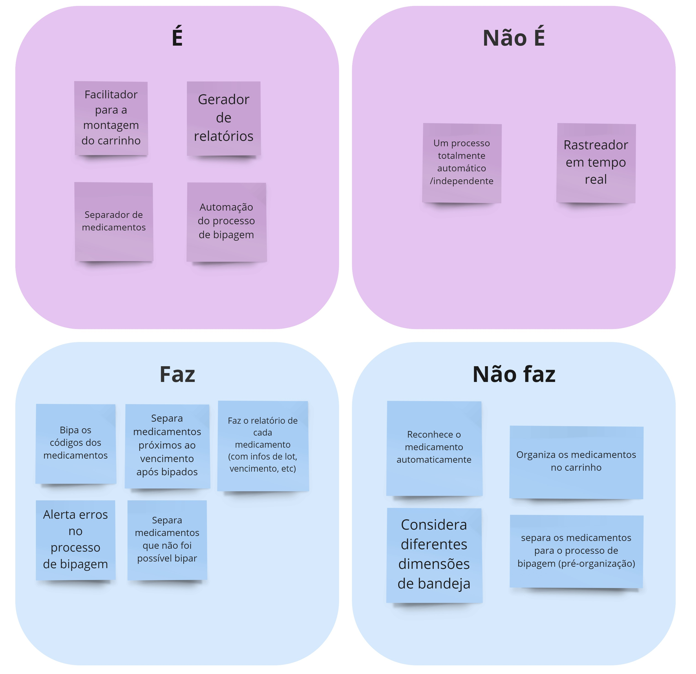

# Introdução
O presente site tem como propósito fornecer uma visão abrangente sobre o projeto Ad Alma, uma colaboração entre o Hospital Sírio Libanês e os estudantes de engenharia de computação da faculdade Inteli. Aqui, você encontrará uma documentação detalhada sobre a concepção, evolução e implementação do projeto, abordando aspectos cruciais como estratégias de negócios, experiência do usuário e tecnologias empregadas.

## Descrição do projeto
O projeto em desenvolvimento visa aprimorar o processo de reposição e abastecimento dos carrinhos de emergência do Hospital Sírio Libanês. Atualmente, a reposição é realizada manualmente, o que, apesar de funcional, demonstra falta de eficiência, pois uma pessoa é responsável por todo o processo repetitivo, resultando em fadiga e possíveis falhas na verificação das informações dos itens.

Para resolver esses problemas, o projeto propõe a automatização do processo de bipagem dos itens do carrinho, que é identificado como o principal responsável pelas dificuldades mencionadas. Dessa forma, o projeto busca garantir a segurança e otimização do tempo do processo, compreendendo o impacto positivo que isso terá na vida de quem é responsável pelo abastecimento, e, em grande escala, na qualidade do atendimento prestado aos pacientes do hospital.

A implementação dessa solução tecnológica não apenas reduzirá os erros humanos, mas também permitirá uma gestão mais eficiente dos recursos, garantindo que os carrinhos estejam sempre prontos para uso, o que é crucial em situações de emergência. Além disso, a automatização liberará os funcionários para se concentrarem em tarefas mais complexas e de maior valor agregado, contribuindo para uma equipe mais motivada e produtiva.

## Leane Inception

## Backlog do projeto

### Backlog Sprint 1

### Backlog Sprint 2

## Ad Alma

Inspirado em Adma Jafet, fundadora do Hospital Sírio Libanês, e o Conceito em Latim de Ad Astra ("alcançar a glória por caminhos árduos") o projeto Ad Alma foi contruído. 

Ad Alma, eficiência e segurança salvam vidas.

### Integrantes
[Ana Clara Madureira Marques](https://www.linkedin.com/in/ana-clara-madureira-marques/)

[Guilherme Ferreira Linhares](https://www.linkedin.com/in/guilherme-ferreira-linhares-8638411a1/)

[Gustavo Gouveia](https://www.linkedin.com/in/gustavo-gouveia-583185271/)

[José Vitor Alencar Silva](https://www.linkedin.com/in/jos%C3%A9-vitor-alencar-161243211/)

[Lucas Nogueira Storelli de Luccas](https://www.linkedin.com/in/lucasdeluccas/)

[Luiza Souza Rubim](https://www.linkedin.com/in/luiza-rubim/)

[Pedro Henrique de Azeredo Coutinho Cruz](https://www.linkedin.com/in/pedro-henrique-coutinho-cruz/)

## Versionamento da documentação