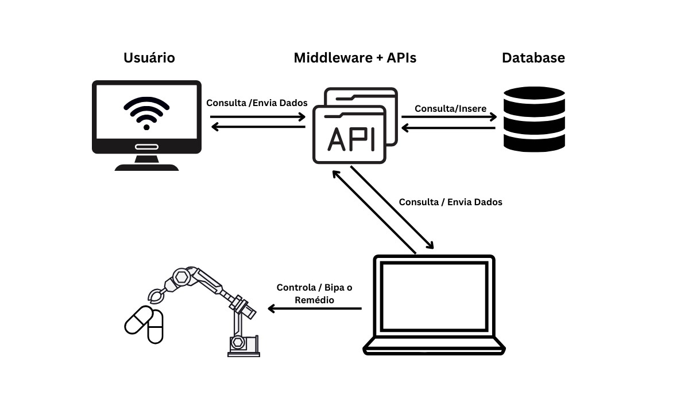

# Proposta de Arquitetura do Sistema

Abaixo se encontram documentos de computação referentes à Sprint 1. Eles auxiliam a entender os requisitos, arquitetura e funcionalidades do projeto.
<!-- Escreva embaixo de cada título com '##' -->

## Requisitos Funcionais
**RF1 - Automação do processo de bipagem dos medicamentos:**
- A solução deve automatizar o processo de bipagem dos medicamentos utilizando um braço robótico Dobot Magician Lite e uma webcam.
- O braço robótico deve ser capaz de pegar o medicamento, posicionar-se em frente à webcam para capturar o código de barras e soltar o medicamento em um local pré-programado.
- A webcam deve ser capaz de capturar a imagem do código de barras para processamento pelo sistema.

**RF2 - Separação de medicamentos próximos à validade:**
- A solução deve identificar a data de validade de cada medicamento bipado e, se estiver próximo à validade (6 meses de distância), o braço robótico deve realocar o medicamento para um local diferente dos que não estão próximos à validade.

**RF3 - API próprio para o processo:**
A solução deve apresentar um sistema que possa:
  - Receber a informação do carrinho em que o processo de bipagem está sendo feito.
  - Carregar as informações dos medicamentos que devem ser bipados.
  - Receber o nome do responsável pelo reabastecimento do carrinho e a data e horário do processo.
  - Durante o processo de bipagem, mostrar as informações dos medicamentos bipados, incluindo lote e validade.
  - Apresentar um relatório ao final do processo com as informações coletadas.

**RF4 - Relatório com as informações coletadas durante o processo**
- O relatório deve conter as seguintes informações: o código do carrinho, itens faltantes, itens registrados, itens descartados por estarem próximos à validade e imagens registradas pela webcam.
- Deve ser possível baixar o relatório gerado e guardá-lo no banco de dados do hospital para controle dos dados.

**RF5 - Integração entre hardware, API e banco de dados:**
- O sistema deve integrar-se adequadamente com o hardware do braço robótico, o banco de dados do hospital e a API para comunicação eficiente entre os diferentes componentes.
- Deve permitir a verificação do prazo de validade dos itens no momento do processo de bipagem.

## Requisitos Não Funcionais

**RNF1 - Segurança e Confiabilidade:**
- O sistema deve garantir que os medicamentos não sejam danificados durante o processo de bipagem, utilizando um braço robótico com movimentos precisos e uma webcam de alta qualidade para capturar imagens.
- O sistema deve ser capaz de gerar imagens do medicamento no momento da bipagem e registrar essas imagens para que seja possível acessar o relatório e identificar caso o medicamento esteja danificado.
- O sistema deve emitir alertas visuais e sonoros quando não for possível identificar o código de algum dos medicamentos, permitindo que os operadores intervenham e identifiquem o problema.
- Caso algum medicamento não consiga ser identificado, ele deve ser separado dos demais para posterior análise e correção do problema e para que o processo de bipagem possa continuar.

**RNF2 - Usabilidade e Interface de Usuário:**
- O sistema deve ter uma interface de usuário intuitiva e fácil de usar,permitindo que os operadores interajam com o sistema de forma eficiente e sem dificuldades.
- Deve fornecer feedback claro sobre o status do processo de bipagem e outras operações, como a conclusão bem-sucedida da bipagem ou a identificação de um medicamento próximo ao vencimento.

**RNF3 - Desempenho e Escalabilidade:**
- O sistema deve ser capaz de lidar com um grande volume de medicamentos e operações de bipagem sem comprometer o desempenho, utilizando um hardware robusto e uma arquitetura de software otimizada.
- Deve ser capaz de escalar facilmente para atender às necessidades crescentes do hospital e do processo de bipagem, permitindo que posteriormente possam ser feitas adições e customizações nesse sentido.

**RNF4 - Tempo de processamento:**
- O sistema deve ser capaz de gerar as informações dos medicamentos em tempo real na tela principal, utilizando algoritmos de processamento de imagem eficientes e uma comunicação rápida com o banco de dados.
- O processamento do código do medicamento, assim que lido, deve ser o mais rápido possível para possibilitar a continuidade do processo e o melhor desempenho, utilizando técnicas de otimização de código e hardware.

## Diagrama de blocos da arquitetura do sistema

Basicamente, O Robô vai estar acompanhado de um notebook que será essencial tanto para o processo de bipagem quanto para a comunicação com o resto do sistema. No momento que o robô pega um remédio, ele irá mostrar o remédio para a webcam do notebook que fará a leitura do QRCODE contendo as informações desse remédio, com a leitura realizada o notebook irá realizar a inserção dos dados desse remédio (lote, data de Validade, data de Uso, etc) no banco de dados via API. Com as informações inseridas no banco de dados, a aplicação web terá acesso (também via API) à elas, assim possibilitando a liberação desses dados em relatórios e aumentando a rastreabilidade.
## Descrição da forma como os componentes propostos no sistema estão interligados e trocam informações
Nesse sistema existem 5 partes principais. O Robô industrial, o notebook que acompanha o robô, o backend (APIs + Banco de Dados) e o Front end, cada um responsável por uma parte da solução.
- Robô Industrial: O componente principal responsável pela movimentação e interação física com os medicamentos. Após pegar um remédio, o robô exibe-o à webcam do notebook para que esta possa ler o QR code contendo as informações do medicamento.
- Notebook: O notebook acompanha o robô e desempenha um papel crucial no processo de bipagem e comunicação com o resto do sistema. Utiliza sua webcam para realizar a leitura do QR code do medicamento, e uma vez feita a leitura, envia os dados relevantes (lote, data de validade, data de uso, etc.) para o backend por meio de uma API.
- Backend (APIs + Banco de Dados): É o cérebro do sistema. Recebe os dados dos medicamentos do notebook via API e os armazena no banco de dados. Além disso, disponibiliza esses dados para a aplicação web também através de APIs, permitindo a geração de relatórios e aumentando a rastreabilidade dos medicamentos.
- Frontend: A interface através da qual os usuários interagem com o sistema. Utiliza as APIs fornecidas pelo backend para acessar as informações dos medicamentos armazenadas no banco de dados e apresentá-las de forma compreensível aos usuários.

