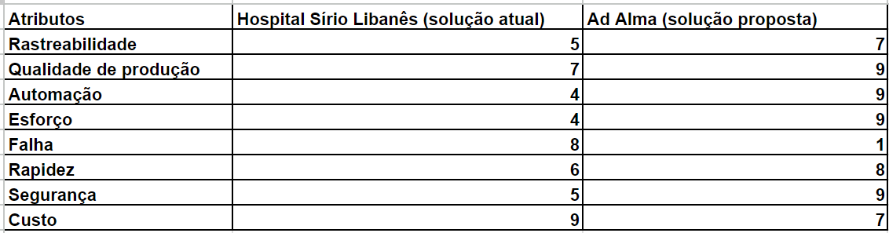

# Entendimento do Negócio

Aba dos documentos de **Negócios**
<!-- Escreva embaixo de cada título com '##' -->

## Matriz Oceano Azul

O conceito por trás da análise da Matriz de Avaliação de Valor Oceano Azul realizada a seguir se encontra no livro ”A Estratégia do Oceano Azul” – Como criar novos mercados e tornar a concorrência irrelevante de Renée Mauborgne e W. Chan Kim. Essa estratégia serve para desenhar modelos de mercados “inexistentes” que, quando encontrados e explorados, são potenciais geradores de vantagens competitivas sustentáveis. O conceito de Oceano Azul é definido justamente como o novo mercado, criado por uma organização, no qual a estratégia não é enfrentar a concorrência, mas gerar um ambiente não concorrencial, cujos concorrentes sofrem dificuldades para replicar, ou imitar, o modelo de negócio proposto pelo inovador de valor, levando a concorrência a ter dificuldade em seguir os passos deste inovador, que entrega ao seu cliente, um valor superior. 

Em nosso contexto, tendo o Hospital Sírio Libanês como parceiro, estamos levando em consideração o seu problema de automatizar a montagem dos carrinhos de emergência, que, justamente, pode trazer vantagem competitiva para o Hospital ao reduzir ineficiências como falhas humanas e minimizar o tempo de montagem dos carrinhos. 

A solução atual em contrapartida com a solução proposta de solucionar o problema pelo nosso grupo receberam notas de 0 a 10 para os seguintes atributos discutidos abaixo. Esses atributos foram escolhidos como parâmetros importantes para o Hospital Sírio Libanês nessa análise: 

**1. Rastreabilidade:**

Neste atributo levamos em consideração a estratégia utilizada por cada solução para 'rastrear' os medicamentos. Entende-se por rastrear processos como o de alertar quando há remédios prestes a vencer com 6 meses de antecedência, a dosagem correta solicitada e a quantidade de medicamentos que foram retirados e precisa repor. 

**2. Qualidade de produção:**

Neste tópico foi levado em consideração a qualidade em que o trabalho de criar os carrinhos de emergência é realizado. O Hospital Sírio Libanês é reconhecido por sua qualidade excepcional no atendimento ao paciente, com uma equipe altamente qualificada e um foco contínuo em excelência ao realizar seus serviços. No entanto, a tarefa de criar os carrinhos, pelo fato de ser um processo repetitivo em larga escala e manual, é suscetível a falhas humanas, não entregando qualidade de forma total. Aspectos como posição dos medicamentos na montagem dos kits, quantidade correta de remédios alocados e dosagem corretas foram avaliados aqui. 

**3. Automação:**

O Sírio Libanês é conhecido por investir constantemente em tecnologia de ponta e inovações médicas, mantendo-se atualizado na medicina e dos tratamentos disponíveis, sendo referência aqui no Brasil. No entanto, no que tange a automação da solução discutida, isso não acontece. A solução proposta traz mais vantagens para automatizar o processo. 

**4. Esforço:**

Este atributo leva em consideração os esforços necessários para gerir o suprimento dessa cadeia de medicamentos. Em média, há 227 itens por carro de emergência. Somente na unidade da Bela Vista do Hospital, há em torno de 89 carros destes. Logo, a gestão de equipes e processos necessária é alta. 

**5. Compromisso social:**

**6. Rapidez:**

Médicos(as) e enfermeiros(as) constantemente precisam de medicamentos, de forma rápida e segura. Por isto, quanto mais rápido a montagem dos kits forem, melhor é o resultado. 

**7. Segurança:**

Todos os hospitais têm altos padrões de segurança, mas o Sírio Libanês é conhecido por sua cultura de segurança robusta e práticas rigorosas para garantir a segurança dos pacientes. Não pode-se medicar um paciente com uma dosagem inadequada ou até mesmo prover um medicamento incorreto. Médicos(as) e enfermeiros(as) não pensam ao pegar os remédios do carrinho, eles só fazem. Por isso, a segurançã é um parâmetro muito importante a ser levado em consideração. 

**8. Custo:**

Todos os itens acima, atualmente, são garantidos por uma equipe. Aqui, avaliamos os custos de manter uma equipe contra a compra de robôs e a manutenção dos mesmos. 

### Reduzir, Eliminar, Aumentar, Criar
A seguir, de acordo com os atributos levantados acima, vamos diferenciar a solução atual com a solução proposta. 

**Reduzir:**
O atributo *custo* pode ser reduzido com relação a solução atual. Pelo fato de não ter mais uma grande equipe tendo que montar de forma manual os carrinhos, os custos salariais diminuíram comparados ao preço de comprar os robôs para automatizar o processo e realizar manutenções. 

Outro atributo que pode potencialmente diminuir é o *esforço* para gerir processos. De forma automatizada, haverá menos estresses e falhas humanas. 

**Eliminar:**

De forma lógica, um atributo que irá eliminar é *falha*. Garantindo um processo de qualidade e seguro, hábitos como posição errônea dos medicamentos na montagem dos kits, quantidade incorreta de remédios alocados e dosagem inadequada não irão acontecer mais.  

**Aumentar:**
Atributos que irão aumentar o valor da solução são: *rastreabilidade, qualidade de produção, segurança*. 

**Criar:** 
*Automação* e *Rapidez* no processo são atributos que não existem atualmente e passariam a existir com a solução proposta, englobando todos os benefícios citados ao longo da análise. 

## Matriz de Risco
## Canvas Proposta de Valor
## Análise financeira do projeto

