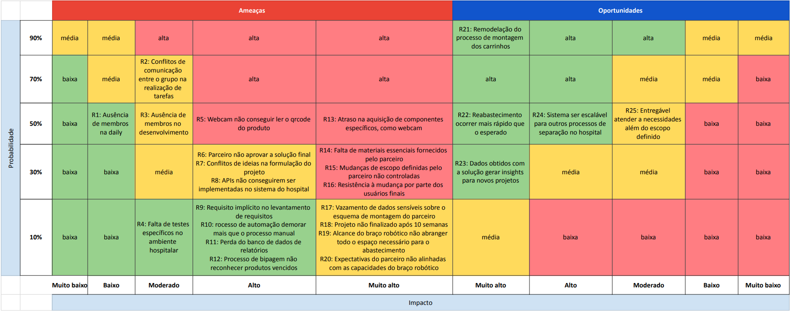

# Entendimento do Negócio

Aba dos documentos de **Negócios**
<!-- Escreva embaixo de cada título com '##' -->

## Matriz Oceano Azul
## Matriz de Risco

&nbsp;&nbsp; Uma matriz de risco é uma ferramenta de gerenciamento de projetos amplamente utilizada para identificar, avaliar e priorizar os riscos potenciais que podem afetar o sucesso do projeto. Ela se torna relevante pois metrifica e categoriza os riscos e oportunidades numa matriz probabilidade x impacto, tornando assim mais tangível a mitigação dos riscos e o aproveitamento das oportunidades. No contexto do projeto para o Hospital Sírio-Libanês, a matriz de risco é crucial para antecipar e mitigar possíveis obstáculos que poderiam atrasar a conclusão do projeto ou comprometer sua eficácia. Além disso, ela ajuda a identificar oportunidades que podem ser aproveitadas para estender os benefícios do projeto além de seu escopo inicial.

&nbsp;&nbsp;Tendo isso em mente, segue uma lista com os principais riscos e oportunidades levantados pela equipe e como elas se enquadram na matriz.

### Riscos

1. **Ausência de membros ao longo do projeto:** A ausência de um membro do grupo, como em casos de doenças ou atrasos, pode impactar no andamento das atividades do projeto e comprometer a qualidade das entregas;
2. **Desalinhamento de escopo entre o grupo e o parceiro:** A diferença de expectativas entre a entrega e o que é esperado pelo parceiro pode gerar reajustes significativos ao longo das sprints, de modo que o retrabalho impacta no desempenho do projeto e na entrega final;
3. **Sistema não ser compatível com o do hospital:** A incompatibilidade do sistema desenvolvido com as infraestruturas existentes no hospital pode demandar retrabalho e causar atrasos na implementação. Tendo em vista que o escopo não abrange sistemas de login e compatibilidade com a plataforma desenvolvida, é esperado que esse risco tenha menor probabilidade do que geralmente ocorre em outros projetos;
4. **Conflitos de comunicação entre o grupo:** Dificuldades de comunicação interna podem levar a mal-entendidos, atrasos e conflitos, impactando negativamente o andamento do projeto. Espera-se que esse risco seja mitigado com as dailys a utilização da comunicação não agressiva durante o desenvolvimento;
5. **Falta de materiais necessários para a solução:**  A escassez de materiais específicos requisitados ao longo do projeto e que não estavam previstos nos materiais iniciais pode comprometer o desenvolvimento da funcionalidade com o material em questão ou das funcionalidades que dependem desse material, acarretando em atrasos no projeto;
6. **Parceiro não aprovar a solução final:** Apesar de haver validações ao final de cada sprint, é possível que os ajustes realizados na sprint 5 não estejam de acordo com as expectativas do parceiro e, por se tratar da entrega final, impossibilita de futuras alterações pela equipe. Apesar desse risco existir, é esperado que a sprint 5 seja somente para refinamento dos critérios já levantados pelo parceiro na sprint anterior;
7. **Atrasos no projeto pela falta de materiais essenciais fornecidos pelo parceiro:** Em casos que o projeto necessita de materiais específicos do parceiro, como fonte de dados ou funcionamento de sistemas, a entrega desse material além do prazo esperado pode impactar no andamento do projeto e até mesmo ocasionar em algumas funcionalidades não entregues ou com pendências;
8. **Vazamento de dados sensíveis sobre o parceiro:** A exposição de informações confidenciais do parceiro pode prejudicar a relação comercial e causar danos à reputação das partes envolvidas;
9. **Projeto não finalizado após 10 semanas:** Esse risco se deriva de diversos riscos envolvendo o andamento e o retrabalho da entrega ao longo do projeto, tendo em vista que esses impecilhos podem impactar na entrega final.

### Oportunidades

10. **Remodelação do processo de montagem dos carrinhos:** Sabendo que o projeto abrange somente o braço robótico para o abastecimento dos carrinhos, há a possibilidade do hospital redesenhar a cadeia de montagem e manutenção dos carrinhos de emergência, haja vista a implementação de uma etapa diferente no processo. Essa oportunidade se mostra com alta possibilidade de ocorrência, uma vez que o braço robótico exige novas verificações no processo, como conferência do qrCode, como lidar com produtos vencidos, possíveis falhas da automação, entre outros.
11. **Dados obtidos com a solução gerar insights para novos projetos:** Os dados coletados durante a operação do sistema podem fornecer insights valiosos para o desenvolvimento de novas soluções de automação não só para o processo em si da montagem de carrinhos, mas também para outros processos dentro do hospital. Essa oportunidade trará muitos benefícios valiosos para os processos na área da saúde e de logística no geral.
12. **Sistema ser escalável para outros processos de separação:** A possibilidade de expandir o uso do sistema desenvolvido para outras atividades de separação pode abrir novos mercados e oportunidades de negócio não só para o parceiro, mas também para futuros projetos com o Inteli;
13. **Entregável atender a necessidades além do escopo do projeto:** A entrega de soluções que excedem as expectativas do cliente pode resultar em reconhecimento e possíveis projetos futuros para o Inteli.

&nbsp;&nbsp;Tendo os riscos e as oportunidades mapeados, foram avaliadas suas possíveis ocorrências e quais os impactos gerados, a fim de se preparar para cada risco que possa acontecer. Segue a imagem da matriz:

#### Imagem 1 - Matriz de risco

Fonte: autoria própria.

Portanto, a partir dos riscos mapeados e elencados, espera-se que a equipe consiga prevenir e antecipar comportamentos para mitigar os riscos e garantir o sucesso do projeto.

## Canvas Proposta de Valor
## Análise financeira do projeto

