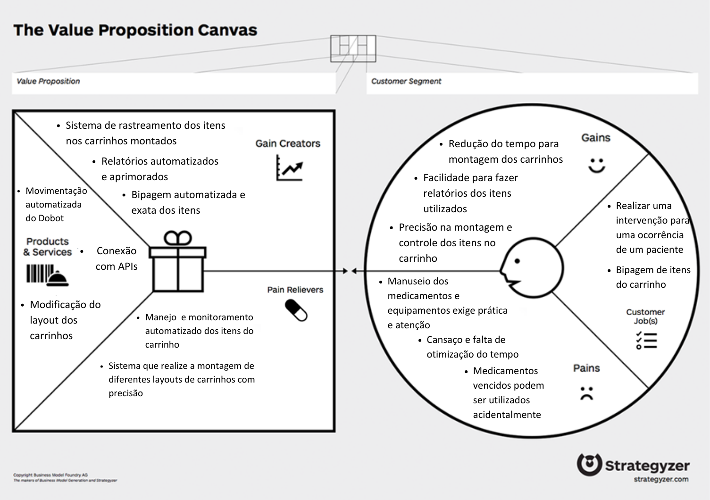

# Entendimento do Negócio

Abaixo se encontram documentos do Entendimento do **Negócio** referentes à Sprint 1. Eles servem para auxiliar na compreensão do Hospital Sírio-Libanês, avaliando o mercado, riscos, oportunidades e valor do parceiro. 

<!-- Escreva embaixo de cada título com '##' -->

## Matriz Oceano Azul

O conceito por trás da análise da Matriz de Avaliação de Valor Oceano Azul realizada a seguir se encontra no livro ”A Estratégia do Oceano Azul” – Como criar novos mercados e tornar a concorrência irrelevante de Renée Mauborgne e W. Chan Kim. Essa estratégia serve para desenhar modelos de mercados “inexistentes” que, quando encontrados e explorados, são potenciais geradores de vantagens competitivas sustentáveis. O conceito de Oceano Azul é definido justamente como o novo mercado, criado por uma organização, no qual a estratégia não é enfrentar a concorrência, mas gerar um ambiente não concorrencial, cujos concorrentes sofrem dificuldades para replicar, ou imitar, o modelo de negócio proposto pelo inovador de valor, levando a concorrência a ter dificuldade em seguir os passos deste inovador, que entrega ao seu cliente, um valor superior. 

Em nosso contexto, tendo o Hospital Sírio Libanês como parceiro, estamos levando em consideração o seu problema de automatizar a montagem dos carrinhos de emergência, que, justamente, pode trazer vantagem competitiva para o Hospital ao reduzir ineficiências como falhas humanas e minimizar o tempo de montagem dos carrinhos. 

### Atributos

A solução atual em contrapartida com a solução proposta de solucionar o problema pelo nosso grupo receberam notas de 0 a 10 para os seguintes atributos discutidos abaixo. Esses atributos foram escolhidos como parâmetros importantes para o Hospital Sírio Libanês nessa análise: 

**1. Rastreabilidade:**

Neste atributo levamos em consideração a estratégia utilizada por cada solução para 'rastrear' os medicamentos. Entende-se por rastrear processos como o de alertar quando há remédios prestes a vencer com 6 meses de antecedência, a dosagem correta solicitada e a quantidade de medicamentos que foram retirados e precisa repor. 

**2. Qualidade de produção:**

Neste tópico foi levado em consideração a qualidade em que o trabalho de criar os carrinhos de emergência é realizado. O Hospital Sírio Libanês é reconhecido por sua qualidade excepcional no atendimento ao paciente, com uma equipe altamente qualificada e um foco contínuo em excelência ao realizar seus serviços. No entanto, a tarefa de criar os carrinhos, pelo fato de ser um processo repetitivo em larga escala e manual, é suscetível a falhas humanas, não entregando qualidade de forma total. Aspectos como posição dos medicamentos na montagem dos kits, quantidade correta de remédios alocados e dosagem corretas foram avaliados aqui. 

**3. Automação:**

O Sírio Libanês é conhecido por investir constantemente em tecnologia de ponta e inovações médicas, mantendo-se atualizado na medicina e dos tratamentos disponíveis, sendo referência aqui no Brasil. No entanto, no que tange a automação da solução discutida, isso não acontece. A solução proposta traz mais vantagens para automatizar o processo. 

**4. Esforço:**

Este atributo leva em consideração os esforços necessários para gerir o suprimento dessa cadeia de medicamentos. Em média, há 227 itens por carro de emergência. Somente na unidade da Bela Vista do Hospital, há em torno de 89 carros destes. Logo, a gestão de equipes e processos necessária é alta. 

**5. Falha:**

Posição errônea dos medicamentos na montagem dos kits, quantidade incorreta de remédios alocados, dosagem inadequada e medicamentos vencidos são falhas que estamos considerando nessa análise. 

**6. Rapidez:**

Médicos(as) e enfermeiros(as) constantemente precisam de medicamentos, de forma rápida e segura. Por isto, quanto mais rápido a montagem dos kits forem, melhor é o resultado. 

**7. Segurança:**

Todos os hospitais têm altos padrões de segurança, mas o Sírio Libanês é conhecido por sua cultura de segurança robusta e práticas rigorosas para garantir a segurança dos pacientes. Não pode-se medicar um paciente com uma dosagem inadequada ou até mesmo prover um medicamento incorreto. Médicos(as) e enfermeiros(as) não pensam ao pegar os remédios do carrinho, eles só fazem. Por isso, a segurança é um parâmetro muito importante a ser levado em consideração. 

**8. Custo:**

Todos os itens acima, atualmente, são garantidos por uma equipe. Aqui, avaliamos os custos de manter uma equipe contra a compra de robôs e a manutenção dos mesmos. 

### Reduzir, Eliminar, Aumentar, Criar
A seguir, de acordo com os atributos levantados acima, vamos diferenciar a solução atual com a solução proposta. 

**Reduzir:**
O atributo *custo* pode ser reduzido com relação a solução atual. Pelo fato de não ter mais uma grande equipe tendo que montar de forma manual os carrinhos, os custos salariais diminuíram comparados ao preço de comprar os robôs para automatizar o processo e realizar manutenções. 

Outro atributo que pode potencialmente diminuir é o *esforço* para gerir processos. De forma automatizada, haverá menos estresses e falhas humanas. 

**Eliminar:**

De forma lógica, um atributo que irá eliminar é *falha*. Garantindo um processo de qualidade e seguro, hábitos como posição errônea dos medicamentos na montagem dos kits, quantidade incorreta de remédios alocados e dosagem inadequada não irão acontecer mais.  

**Aumentar:**
Atributos que irão aumentar o valor da solução são: *rastreabilidade, qualidade de produção, segurança*. A solução atual já possui, mas a probabilidade de aumentar é muito maior na solução proposta. 

**Criar:** 
*Automação* e *Rapidez* no processo são atributos que não existem atualmente e passariam a existir com a solução proposta, englobando todos os benefícios citados ao longo da análise. 

### Conclusão
É possível notar que o Hospital Sírio-Libanês poderá criar uma vantagem competitiva com a solução proposta, explorando uma área desconhecida no setor de hospitais: automação. Justamente como comentado anteriormente, este foi o intuito dessa matriz, de criar um ambiente novo e explorável.

Pode-se observar o gráfico e a tabela neste [link](https://docs.google.com/spreadsheets/d/1Fo8MluvH3LwzdM6_R_9w_iJGFozd0OFP/edit?usp=sharing&ouid=111633637216461954292&rtpof=true&sd=true).

## Matriz de Risco

&nbsp;&nbsp; Uma matriz de risco é uma ferramenta de gerenciamento de projetos amplamente utilizada para identificar, avaliar e priorizar os riscos potenciais que podem afetar o sucesso do projeto. Ela se torna relevante pois metrifica e categoriza os riscos e oportunidades numa matriz probabilidade x impacto, tornando assim mais tangível a mitigação dos riscos e o aproveitamento das oportunidades. No contexto do projeto para o Hospital Sírio-Libanês, a matriz de risco é crucial para antecipar e mitigar possíveis obstáculos que poderiam atrasar a conclusão do projeto ou comprometer sua eficácia e, considerando que envolve a saúde dos pacientes, é vital antecipar esses riscos. Além disso, ela ajuda a identificar oportunidades que podem ser aproveitadas para estender os benefícios do projeto além de seu escopo inicial.

&nbsp;&nbsp;Tendo isso em mente, segue uma lista com os principais riscos e oportunidades levantados pela equipe e como elas se enquadram na matriz.

### Riscos

1. **Ausência de membros na daily**: A ausência de um membro na daily impacta sobre o conhecimento do membro em relação ao andamento das atividades do grupo, bem como dificulta na comunicação em caso de possíveis atrasos de atividade do membro ausente ou tarefas de outros membros dependentes dessa tarefa não cumprida. Portanto, para reduzir esse dano, é necessário que o membro ausente adicione sua daily no Slack; 
2. **Conflitos de comunicação entre o grupo na realização de tarefas:** O desentendimento dos membros em relação a tarefas atrasadas ou em casos de tarefas mal executadas pode gerar conflitos e retrabalhos que afetam o desempenho e a convivência da equipe;
3. **Ausência de membros no desenvolvimento:** A ausência de contribuição dos membros durante o período de desenvolvimento pode afetar o ritmo de entrega do grupo, bem como sobrecarregar os membros que se responsabilizarão pela ausência;
4. **Falta de testes específicos no ambiente hospitalar:** É possível que a falta de testes específicos que não podem ser simulados em ambiente de desenvolvimento, como a disposição dos produtos após o uso do carrinho pelos profissionais, possa afetar o desempenho da solução quando aplicada em contextos reais. Sendo assim, caso seja necessário, deve-se requisitar um teste em ambiente de uso para o parceiro;
5. **Webcam não conseguir ler o qrcode do produto:** Apesar de poder funcionar nos testes, é possível que a disposição do produto tenha a visibilidade do qrcode dificultada e o sensor não leia. Portanto, é preciso implementar mecanismos que lidem com esses possíveis casos, como o acionamento de alarmes ou notificações;
6. **Parceiro não aprovar a solução final:** Apesar de haver validações ao final de cada sprint, é possível que os ajustes realizados na sprint 5 não estejam de acordo com as expectativas do parceiro e, por se tratar da entrega final, impossibilita de futuras alterações pela equipe. Apesar desse risco existir, é esperado que a sprint 5 seja somente para refinamento dos critérios já levantados pelo parceiro na sprint anterior;
7. **Conflitos de ideias na formulação do projeto:** Durante o levantamento de ideias, há a possibilidade de conflitos de opiniões que afetem nas decisões do grupo, além do andamento do projeto. Nesses casos, espera-se o uso da comunicação não violenta para resolver esse problema e prosseguir com o desenvolvimento;
8. **APIs não conseguirem ser implementadas no sistema do hospital:** A incompatibilidade do sistema desenvolvido com as infraestruturas existentes no hospital pode demandar retrabalho e causar atrasos na implementação. Tendo em vista que o escopo não abrange sistemas de login e compatibilidade com a plataforma desenvolvida, é esperado que esse risco tenha menor probabilidade do que geralmente ocorre em outros projetos;
9. **Requisito implícito no levantamento de requisitos:** É possível que algum requisito necessário não tenha sido adicionado à lista de requisitos e, ao avaliar nos testes, não haja uma boa implementação pela falta de métricas de avaliação;
10. **Processo de automação demorar mais que o processo manual:** Apesar da expectativa da implementação de uma automação seja a redução no tempo de execução, é possível que a adição de verificações e comportamentos do sistema em casos de erro na leitura do qrcode, por exemplo, aumente seu tempo de execução a ponto de ser superior ao processo manual. Nesse caso, a equipe deve reavaliar o desempenho de cada etapa de verificação e melhorar a etapa que impacta mais na velocidade do processo;
11. **Perda do banco de dados de relatórios:** Esse risco pode impactar tanto no processo de desenvolvimento com a falta da listagem de produtos a serem bipados como afetar na execução dos testes.
12. **Processo de bipagem não reconhecer produtos vencidos:** Esse risco tem um alto impacto devido às consequências de uma falsa validação, haja vista que se tratam de ferramentas e medicamentos que afetam a vida do paciente, logo, podem gerar sérios danos. Para não ocorrer esse risco, são necessários vários testes com várias casos e condições adversas, para garantir a confiabilidade do processo;
13. **Atraso na aquisição de componentes específicos, como webcam:** A escassez de materiais específicos requisitados ao longo do projeto e que não estavam previstos nos materiais iniciais pode comprometer o desenvolvimento da funcionalidade com o material em questão ou das funcionalidades que dependem desse material, acarretando em atrasos no projeto;
14. **Falta de materiais essenciais fornecidos pelo parceiro:** Em casos que o projeto necessita de materiais específicos do parceiro, como fonte de dados ou funcionamento de sistemas, a entrega desse material além do prazo esperado pode impactar no andamento do projeto e até mesmo ocasionar em algumas funcionalidades não entregues ou com pendências;
15. **Mudanças de escopo definidas pelo parceiro não controladas:** Podem acontecer mudanças de necessidades do projeto por mudanças internas do parceiro ou regulamentações não esperadas. Portanto, é importante pensar nesse risco e antecipar para que o planejamento do grupo seja flexível para esses casos e haja uma reavaliação do entregável final;
16. **Resistência à mudança por parte dos usuários finais:** A solução automatizada pode trazer resistência aos profissionais que a utilizarão devido à adoção de novos procedimentos, mudanças na rotina, lidar com situações de erro e manutenção do sistema, entre outros obstáculos para a plena utilização da solução;
17. **Vazamento de dados sensíveis sobre o esquema de montagem do parceiro:** A exposição de informações confidenciais do parceiro pode prejudicar sua relação com o Inteli causar danos à reputação das partes envolvidas;
18. **Projeto não finalizado após 10 semanas:** Esse risco se deriva de diversos riscos envolvendo o andamento e o retrabalho da entrega ao longo do projeto, tendo em vista que esses empecilhos podem impactar na entrega final;
19. **Alcance do braço robótico não abranger todo o espaço necessário para o abastecimento:** Há casos em que a quantidade de itens dispostos para organização do carrinho seja além para o espaço de alcance do braço robótico. É possível reduzir esse risco com testes e simulações mais próximas da realidade, além do acordo com o parceiro sobre o tamanho e a quantidade dos itens;
20. **Expectativas do parceiro não alinhadas com as capacidades do braço robótico:** A expectativa de algumas funcionalidades pelo parceiro podem não ser atingidas pela capacidade do braço robótico utilizado, um risco que pode ser descoberto somente após a implementação e durante a fase de testes. Nesse caso, cabe à equipe informar ao parceiro e reavaliar uma adaptação da funcionalidade para as capacidades físicas e mecânicas da prova de conceito.

### Oportunidades

21. **Remodelação do processo de montagem dos carrinhos:** Sabendo que o projeto abrange somente o braço robótico para o abastecimento dos carrinhos, há a possibilidade do hospital redesenhar a cadeia de montagem e manutenção dos carrinhos de emergência, haja vista a implementação de uma etapa diferente no processo. Essa oportunidade se mostra com alta possibilidade de ocorrência, uma vez que o braço robótico exige novas verificações no processo, como conferência do qrCode, como lidar com produtos vencidos, possíveis falhas da automação, entre outros;
22. **Reabastecimento ocorrer mais rápido que o esperado:** Uma grande oportunidade seria a superação da expectativa da equipe quanto ao desempenho e velocidade de execução da solução, o que contribuiria mais ainda para o hospital como um todo;
23. **Dados obtidos com a solução gerar insights para novos projetos:** Os dados coletados durante a operação do sistema podem fornecer insights valiosos para o desenvolvimento de novas soluções de automação não só para o processo em si da montagem de carrinhos, mas também para outros processos dentro do hospital. Essa oportunidade trará muitos benefícios valiosos para os processos na área da saúde e de logística no geral;
24. **Sistema ser escalável para outros processos de separação:** A possibilidade de expandir o uso do sistema desenvolvido para outras atividades de separação pode abrir novos mercados e oportunidades de negócio não só para o parceiro, mas também para futuros projetos com o Inteli;
25. **Entregável atender a necessidades além do escopo do projeto:** A entrega de soluções que excedem as expectativas do cliente pode resultar em reconhecimento e possíveis projetos futuros para o Inteli.

&nbsp;&nbsp;Tendo os riscos e as oportunidades mapeados, foram avaliadas suas possíveis ocorrências e quais os impactos gerados, a fim de se preparar para cada risco que possa acontecer. Segue a imagem da matriz:

#### Imagem 1 - Matriz de risco

[Autoria Própria](https://docs.google.com/spreadsheets/d/1AOd8tvEviWtPYGU7tg4_KYf8s9u_XR6VpP41e34wfy8/edit?usp=sharing)

&nbsp;&nbsp;Portanto, a partir dos riscos mapeados e elencados, espera-se que a equipe consiga prevenir e antecipar comportamentos para mitigar os riscos e garantir o sucesso do projeto.

## Canvas Proposta de Valor

O Canvas Proposta de Valor é uma ferramenta estratégica utilizada para compreender o valor de um produto ou serviço oferecido para o cliente. Ele é composto por dois blocos:
* "Perfil do Cliente": Esta parte do Canvas foca em identificar os clientes-alvo para entender suas necessidades, desejos, dores e ganhos. Ela ajuda as empresas a entenderem melhor o que os clientes valorizam e o que estão dispostos a pagar.
* "Mapa de Valor": Esta parte do Canvas foca em identificar os produtos e serviços que criam valor para os clientes. Ela ajuda as empresas a entenderem como podem diferenciar-se da concorrência e criar valor para eles.
Abaixo, segue o Canvas Proposta de Valor do projeto:

### Conclusão 
A estratégia proposta busca alinhar de maneira holística os produtos e serviços oferecidos, os benefícios proporcionados e as necessidades específicas do segmento de cliente. Com um foco incisivo na inovação, precisão e adaptabilidade, a proposta de valor é robustamente fortalecida, visando não apenas atender, mas superar as expectativas do mercado. 

## Análise financeira do projeto
A análise financeira é fundamental para qualquer projeto, pois fornece insights valiosos sobre a viabilidade econômica e a sustentabilidade a longo prazo. Ao avaliar os aspectos financeiros de um projeto, como investimentos necessários, fluxo de caixa esperado, custos operacionais e potenciais retornos, os gestores podem tomar decisões embasadas e identificar oportunidades de otimização. Além disso, a análise financeira ajuda a mitigar riscos, maximizar lucros e garantir que os recursos sejam alocados de forma eficiente, contribuindo para o sucesso e a solidez do empreendimento. Todas as cotações aqui demonstradas foram enviadas para as equipes de desenvolvimento pela Minipa, e é importante deixar claro que estará sendo analisado o custo por carrinho, permitindo uma visão adaptável as necessidades do parceiro e do planejamento de implementação do projeto.

A respeito do custo pelos robôs, foram enviados 3 modelos diferentes. O MG400, O CR3 e o CR10.
| Robô     | Preço |
|----------|--------------|
| MG400    | R$32.000,00  |
| CR3      | R$160.000,00 | 
| CR10     | R$250.000,00 | 

Além disso, cada robô precisaria estar acompanhado de um notebook, e foi utilizado como configuração mínima um computador com um core i3 e 8GB de RAM, que fica em uma média de R$2000.

Pensando apenas no carrinho, a faixa de preço ficaria entre R$34.000,00 e R$252.000,00, porém é necessário manter uma aplicação web + Backend rodando 24 horas por dia, que poderia ser mantido junto com os outros serviços web do cliente, porém caso um serviço cloud fosse contratado (AWS utilizada como referência), custaria uma média entre USD20 e USD40, totalizando USD240-USD480 por ano. Que resulta em R$1200 a R$2400 por ano, utilizando o câmbio do dia 14/02/2024 (R$4,97)

Fontes: 
- [Aws Calculator](https://calculator.aws)
- Documentos da Minipa
- [Amazon](https://www.amazon.com.br/s?k=notebook+core+i3&__mk_pt_BR=%C3%85M%C3%85%C5%BD%C3%95%C3%91&crid=3405JDRES1CZK&sprefix=notebook+core+%2Caps%2C262&ref=nb_sb_noss_2)
