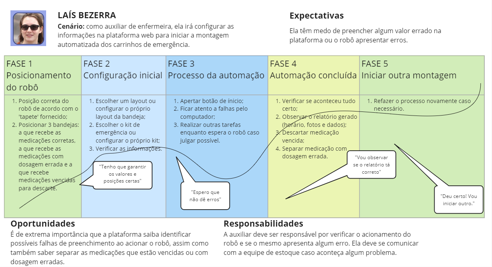
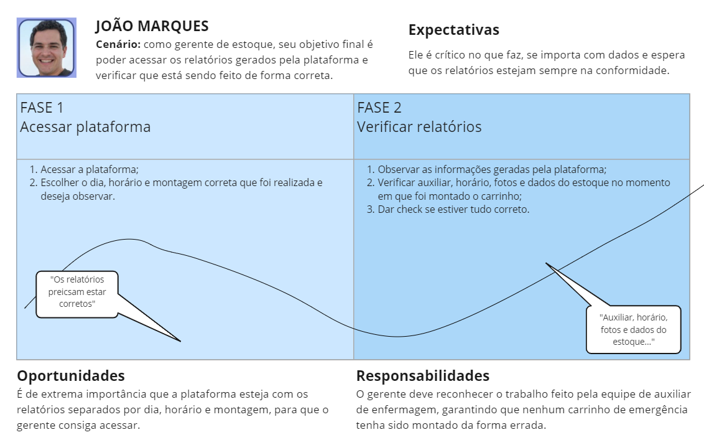

# Experiência do Usuário

Abaixo se encontram documentos do Entendimento do **Usuário** referentes à Sprint 1. Eles auxiliam em uma melhor compreensão do usuário, suas dores e fluxo na solução. 
<!-- Escreva embaixo de cada título com '##' -->

## Imersão Preliminar

**Introdução**

A pesquisa preliminar tem como objetivo principal definir o escopo do projeto realizado em colaboração entre o grupo Ad Alma e a empresa Sírio Libanês, com foco na área de farmácia. Adicionalmente, busca-se compreender as restrições, necessidades e pontos críticos do projeto, assim como entender o contexto empresarial e setorial pertinentes. Além disso, pretende-se analisar a interação dos usuários com a solução, compreender seu impacto e extrair as informações necessárias para elaborar um projeto que atenda plenamente aos requisitos estabelecidos.

A pesquisa é fundamental para o sucesso do projeto, pois permite a coleta de dados essenciais para o seu desenvolvimento. Isso possibilita a construção de um projeto que esteja alinhado com as necessidades dos usuários desde o início, reduzindo significativamente o risco de desenvolver uma solução que não atenda às expectativas do cliente. Além disso, a pesquisa preliminar contribui para a identificação precoce de possíveis problemas e desafios, o que permite ajustes e correções antes mesmo do início efetivo do projeto. Dessa forma, investir tempo e recursos em uma pesquisa preliminar robusta é fundamental para garantir o sucesso e a eficácia do design system.

Para direcionar e executar a pesquisa de forma eficiente e atingir o objetivo proposto, o grupo optou por se aprofundar nos documentos fornecidos, participar do kick-off com os parceiros e conduzir uma sessão de perguntas subsequente. Além disso, na etapa de pesquisa desk, o foco foi explorar tópicos relacionados aos temas destacados na pesquisa exploratória, utilizando o Google Acadêmico para encontrar artigos que pudessem contribuir para o desenvolvimento do projeto.

**Pesquisa exploratória**

A pesquisa exploratória foi conduzida por meio de dois eventos principais realizados no INTELI - Instituto de Tecnologia e Liderança: o Kick-off com os stakeholders (Conrad e Lorena) e uma sessão de perguntas sobre o projeto com um dos stakeholders (Lorena).
O Kick-off, realizado às 14h do dia 05/02/2024, contou com a participação dos parceiros do projeto, os quais apresentaram de forma expositiva informações sobre a empresa e o projeto aos estudantes presentes, por meio de uma apresentação de slides. Esta atividade possibilitou a coleta das primeiras informações sobre a empresa e o projeto, além de esclarecer dúvidas iniciais que surgiram durante a apresentação.

Dois dias depois, em 07/02/2024 às 16h, ocorreu a sessão de perguntas, exclusivamente com a participação da parceira (Lorena). A sessão foi estruturada de modo que a parceira estava no centro e respondia a perguntas pré-elaboradas pelos estudantes, garantindo que todas as respostas fossem audíveis para todos os presentes. As perguntas feitas podem ser acompanhadas no apêndice A, fixado no fim da pesquisa preliminar.

Todas as informações obtidas durante esses dois eventos foram registradas em formato textual, e todas as informações diretamente fornecidas pelos parceiros foram compartilhadas com os alunos para futuras consultas.

A partir das informações coletadas, foi possível definir melhor o escopo do projeto, em relação ao que é esperado e como deve ser desenvolvido. Para uma compreensão mais detalhada das informações extraídas, dividimos a pesquisa em três partes distintas:

1. Informações pré-estabelecidas:
    Antes dos eventos de esclarecimento do escopo, os estudantes já estavam cientes de que iriam desenvolver a automação do processo de montagem de carrinhos de emergência do Hospital Sírio Libanês. Além disso, foi possível obter informações sobre o problema atual do setor, os objetivos e o escopo macro da solução, bem como as restrições gerais por meio da TAPI do projeto. Dentre as principais informações extraídas do arquivo, destacam-se:
     - Os benefícios esperados pela solução: "redução no tempo para montagem dos carrinhos de emergência e relatórios dos itens utilizados (API/Visualização)."
     - O problema que deve ser resolvido: "facilitar a rotina de montagem dos carrinhos de emergência."
     - As necessidades que devem ser atendidas: considerar os diferentes layouts dos carrinhos para a automação e para o sistema (API); integrar com o sistema do hospital; possibilitar o rastreamento dos medicamentos dentro do carrinho.
     - As restrições do projeto: o projeto deve se limitar a um braço robótico em escala reduzida para a prova de conceito; o projeto não contempla integração com sistemas de logins; as tecnologias utilizadas estarão dentro do escopo do módulo estabelecido pela instituição.

2. Informações do Kick-off:
   - Durante o kick-off, foram apresentadas informações sobre a história da empresa, seus valores institucionais e a operação da farmácia do hospital, incluindo o processo de montagem dos carrinhos de emergência atualmente utilizado. Durante a apresentação, foram destacados os desafios e oportunidades de melhoria no processo atual.

3. Informações da roda de perguntas:
    Durante a roda de perguntas, foram extraídas diversas informações complementares que esclareceram o contexto da solução e como deve ser executada, sendo possível extrair as seguintes informações:
     Em relação aos usuários e ao que é esperado:
        - Os principais usuários são: o auxiliar de farmácia (cuida de forma direta da montagem) com uma faixa etária de 20-30 anos, o médico ou enfermeiro (que utiliza o carrinho após a montagem) com uma faixa etária de 30-60 anos, e o paciente (que se beneficia da solução, mas não a utiliza de forma direta).
        - O principal ganho que a solução pode oferecer é em relação ao tempo gasto, principalmente em relação ao processo de bipagem, que é hoje o mais demorado e com maior chances de erro. Além disso, existem outros problemas na forma manual como é realizado o processo hoje, como por exemplo: a possibilidade de erro humano ao colocar o medicamento em um lugar errado, ou bipar o mesmo código de medicamento várias vezes.
        - O maior desafio para a solução proposta é que ela pode esbarrar na demanda de confiabilidade para o processo. Ela deve agregar valor trazendo mais segurança e de forma alguma reduzindo o padrão de segurança atual".
     Configuração dos carrinhos:
        - Os carrinhos apresentam duas categorias diferentes com suas especificidades (o adulto e o pediátrico). Além disso, existem diversos layouts diferentes e com dimensões distintas por terem sido adquiridos em tempos diferentes pelo hospital.
        - A organização em si é pré-definida, dependendo de cada layout cada medicamento deve estar em uma posição diferente.
     Em relação a solução e ao processo de bipagem:
        - Os bips dos medicamentos são feitos no momento de abastecimento do carrinho e cobram o que foi utilizado pela diferença (ou seja, aqueles códigos não bipados foram utilizados). É necessário que todos os medicamentos sejam bipados para garantir a rastreabilidade e a verificação dos vencimentos.
        - Existem dois momentos principais em que o robô pode atuar: verificação do vencimento que ocorre todo o mês e abastecimento do carrinho após o uso.
        - É necessário integrar o banco de dados na solução.
     Em relação ao kit:
        - Além do carrinho, outro possível objeto de desenvolvimento é o kit de emergência. O kit apresenta menos itens em sua composição e menor quantidade de possíveis layouts em relação ao carrinho. Em relação ao processo de montagem, é similar à forma como é feita com o carrinho de emergência.

    Com base na pesquisa exploratória realizada, foram identificados os principais insights para o grupo, incluindo:

     - A importância de aprimorar o processo de bipagem dos itens, visando assegurar a rastreabilidade do sistema.
a necessidade de configurar a solução para lidar com diferentes layouts de gavetas dos carrinhos, podendo essa funcionalidade ser incorporada à própria API.
     - A relevância de realizar testes que comprovem a segurança da automação, garantindo que não haja riscos para os operadores nem para os pacientes do hospital.
     - A importância de considerar dois fluxos distintos: um para a verificação do prazo de validade dos itens e outro para o reabastecimento dos carrinhos.
     - A possibilidade de integrar a verificação do prazo de validade no momento do reabastecimento.

**Pesquisa Desk**

Durante a condução da pesquisa desk, o grupo concentrou-se em aprimorar a compreensão do contexto da solução e identificar projetos similares em andamento. Um dos parâmetros cruciais foi a investigação do avanço da tecnologia e da Indústria 4.0 na área da saúde, destacado em um trabalho de conclusão de curso de um estudante da UNIFESP em 2021. Esse estudo permitiu compreender a relevância da automatização em termos de redução de custos, exemplificada por um hospital piloto que alcançou uma diminuição de 65% nos custos por hora de trabalho para tarefas simples. Além disso, observou-se como essa automação pode otimizar o tempo da equipe de enfermagem, possibilitando uma maior interação com os pacientes.

Outro ponto enfatizado foi a necessidade de personalização das soluções de automatização para cada contexto hospitalar específico, uma vez que as necessidades variam de acordo com a organização, processos, estrutura física e especialidades médicas.

No que diz respeito a projetos relacionados que podem servir como referência, em 2017, uma dupla de alunas da Escola Politécnica da USP desenvolveu um projeto de conclusão de curso intitulado "Automação do processo de conferência dos itens de carros de emergência em um hospital". Esse projeto, similar ao nosso, fornece insights valiosos que podem ser utilizados como referência, especialmente destacando os pontos de atenção identificados nos testes. Por exemplo, a dificuldade em ler etiquetas compostas por metal ou quando estas estão sobrepostas, evidenciando a importância de um sistema de verificação de códigos robusto, independentemente da tecnologia utilizada.

Além disso, a dissertação proporcionou um entendimento mais profundo sobre a integração entre hardware, banco de dados e API, aspectos essenciais que serão implementados na solução.

A partir das informações coletadas, destacaram-se dados cruciais para o desenvolvimento do projeto, tais como:
a necessidade de antecipar potenciais problemas no processo de bipagem ou escaneamento dos códigos dos itens e estar preparado para reverter esses erros de maneira eficiente.
a importância de compreender os fluxos e a integração do braço robótico, da API e do banco de dados em relação às funcionalidades do sistema.
a relevância de considerar o contexto específico do Hospital Sírio Libanês e como o sistema será implementado na área de farmácia já existente.

O método utilizado para pesquisar, definir e coletar os dados, consistiu em buscar temas relacionados ao projeto, como tecnologia, Indústria 4.0 e automação na área da saúde, por meio do Google Acadêmico, filtrando uma gama maior de textos confiáveis. Quanto às fontes utilizadas e escolhidas, considerou-se que as pesquisas acadêmicas citadas anteriormente são confiáveis sobre o assunto, uma vez que envolvem o esforço não só de estudantes das melhores universidades de São Paulo (UNIFESP e USP), mas também contam com referências e a aprovação de orientadores comprometidos com o corpo acadêmico e com experiência nas respectivas áreas tratadas. Para eventuais necessidades de especificação, as fontes utilizadas podem ser verificadas nas referências bibliográficas do projeto ou clicando nos links fornecidos acima.

**Apêndice A**

Perguntas feitas pelo grupo Ad Alma para a parceira:

Quantos layouts diferentes existem? Como eles se distribuem entre as categorias do carrinho (adulto e infantil)? Há a necessidade de se criar muitos layouts de forma recorrente? 
Os carrinhos são montados do zero? Ou também é preciso repor medicamentos pelo robô? 
Como vocês esperam que a nossa solução tenha compatibilidade com o sistema de vocês?
Como vocês imaginam o fluxo da  montagem dos carrinhos de emergência com a automação?. Vocês imaginam onde a parte de rastreabilidade dos medicamentos está inclusa nesse fluxo?  
Os carrinhos são montados por demanda ou existe uma quantidade definida de carrinhos que devem estar de prontidão? 

## Definição das Personas

### Persona 1: Laís

[Autoria Propria](https://www.canva.com/design/DAF8HdCbgpY/NNtg2eGmZL2ivqMbgsg1Pg/edit?utm_content=DAF8HdCbgpY&utm_campaign=designshare&utm_medium=link2&utm_source=sharebutton)

Laís Bezerra é um exemplo de persona que ilustra uma profissional da área de saúde, especificamente no setor de farmácia hospitalar. Aos 30 anos, ela é uma operadora de centro de emergência em São Paulo, Brasil, com 5 anos de experiência na montagem de carrinhos de emergência. Solteira, Laís é descrita como uma pessoa muito dedicada e experiente, que tem facilidade em localizar o que precisa no estoque e é notavelmente organizada e focada.

Pontos Negativos e Desafios:
Laís enfrenta desafios como o desconforto ao assumir riscos e a miopia, que podem influenciar sua performance no trabalho. O processo de montagem dos carros é desgastante e burocrático, o que torna a tarefa demorada e burocrática.

Pontos Positivos e Habilidades:
Ela possui uma habilidade notável para encontrar rapidamente o que precisa no estoque, o que indica uma forte familiaridade com o sistema de organização do local. Além disso, sua dedicação e experiência são ativos valiosos para sua equipe.

Oportunidades e Esperanças:
A oportunidade identificada para Laís é ter mais tempo para concluir outras tarefas, potencialmente através da otimização do processo de montagem dos carros de emergência, o que também é sua esperança. Reduzir o tempo de montagem atual de 50 minutos poderia permitir que ela se dedicasse a outras áreas importantes de seu trabalho.

Ao analisar a persona de Laís Bezerra, fica claro que qualquer solução ou proposta de melhoria deve visar à otimização dos processos burocráticos e à eficiência na montagem dos carrinhos de emergência. Além disso, deve-se considerar o suporte para a tomada de decisão e a compensação de pequenas limitações pessoais, como a miopia. Entender e atender às necessidades e desafios de Laís pode resultar em uma melhoria significativa não apenas em seu desempenho individual, mas também na eficiência operacional geral do centro de emergência. Com isso em mente, as intervenções devem ser direcionadas para a simplificação dos processos, o que, por sua vez, pode aumentar a satisfação no trabalho e a produtividade.

### Persona 2: João

[Autoria Propria](https://www.canva.com/design/DAF8HdCbgpY/NNtg2eGmZL2ivqMbgsg1Pg/edit?utm_content=DAF8HdCbgpY&utm_campaign=designshare&utm_medium=link2&utm_source=sharebutton)

João Marques representa uma persona com papel crucial na gestão de estoque dentro de um contexto hospitalar. Com 50 anos de idade, ele é gerente de estoque no Hospital Sírio Libanês, em São Paulo, Brasil, onde trabalha há uma década. Casado e pai de dois filhos, João é um profissional que valoriza a eficiência e a precisão no controle de inventário.

Pontos Negativos e Desafios:
João é descrito como uma pessoa que pode ser muito estressada e extremamente perfeccionista, o que, por um lado, assegura a qualidade do trabalho, mas por outro, pode gerar uma carga emocional considerável. Ele também enfrenta dificuldades com a confusão gerada pela necessidade de memorizar a quantidade de medicamentos que existem no estoque, o que é uma tarefa desgastante.

Pontos Positivos e Habilidades:
Entre seus pontos fortes estão a vasta experiência e uma boa memória, características que certamente contribuem para a sua competência como gerente de estoque. Tais habilidades são essenciais em um ambiente que exige atenção constante aos detalhes e conhecimento profundo do inventário.

Oportunidades e Esperanças:
Uma oportunidade identificada para João é a implementação de um sistema de notificação que o informe quando a quantidade de itens importantes estiver baixa. Isso não só ajudaria a aliviar o estresse relacionado ao seu perfeccionismo, mas também otimizaria o processo de gestão do estoque. Além disso, João espera por uma otimização geral do processo de montagem, o que poderia aumentar a eficiência do trabalho e permitir que ele se dedicasse a outras responsabilidades estratégicas.

A persona de João Marques nos mostra que a eficiência no gerenciamento de estoque de um hospital não depende apenas da habilidade individual, mas também de sistemas eficazes que possam apoiar o trabalho do gerente. Intervenções que visam a otimização dos processos e a implementação de sistemas automatizados de notificação podem ser altamente benéficas, resultando em uma gestão de estoque mais eficiente e em um ambiente de trabalho menos estressante. Ao abordar as necessidades e esperanças de João, as soluções propostas podem levar a melhorias significativas na operação do hospital e na satisfação dos colaboradores.
## Jornada do Usuário

O Mapa de Jornada do Usuário fornece uma narrativa clara e organizada das experiências, sentimentos, pontos de dor e pontos de satisfação de um usuário ao longo de um processo.

Abaixo se encontram os mapas referentes a cada uma das personas: auxiliar de enfermagem e gerente de estoque. Tentamos mapear o fluxo geral que os usuários vão ter ao acessar a nossa plataforma e ter contato com o robô para automação.

### Jornada - Laís: Auxiliar de Enfermagem

### Jornada - João: Gerente de Estoque

Ambos documentos podem ser observados atráves deste [link.](https://miro.com/app/board/uXjVNr1y_C0=/?share_link_id=190601990822)

## User Stories
### O que são e por que são importantes

As user stories, ou histórias de usuário, são uma técnica usada em métodos ágeis de desenvolvimento de software para capturar requisitos do ponto de vista do usuário final. Elas descrevem uma funcionalidade do sistema a partir da perspectiva do usuário, geralmente em uma única frase curta, focando no que o usuário deseja alcançar e por que isso é importante.

### O que constitui uma User Story?

Uma user story geralmente segue a seguinte estrutura:

- **Quem:** O usuário ou persona envolvido na história.
- **O quê:** A ação que o usuário deseja realizar.
- **Por quê:** O objetivo ou benefício que o usuário espera alcançar.

Por exemplo:

Como um cliente, quero poder fazer login no aplicativo para acessar minha conta bancária e realizar transações online.

### Por que as User Stories são importantes?

1. **Foco no usuário:** As user stories mantêm o foco no usuário final, garantindo que o desenvolvimento de software atenda às necessidades reais dos usuários.

2. **Compreensão compartilhada:** Elas promovem uma compreensão compartilhada entre a equipe de desenvolvimento e os stakeholders sobre o que está sendo construído e por quê.

3. **Flexibilidade:** As user stories permitem que os requisitos sejam capturados de forma flexível e iterativa, adaptando-se às mudanças nas necessidades do usuário ao longo do tempo.

4. **Priorização:** Elas facilitam a priorização do trabalho, permitindo que as funcionalidades mais importantes sejam identificadas e implementadas primeiro.

5. **Estimativa de esforço:** As user stories fornecem uma base para estimar o esforço necessário para implementar uma funcionalidade, ajudando a planejar melhor o trabalho.

Em resumo, as user stories são uma ferramenta valiosa para garantir que o desenvolvimento de software seja centrado no usuário, flexível e focado nas necessidades reais do negócio.

### **User Stories do Projeto**

### Laís Bezerra
- **Descrição:** Operadora do centro de emergência, 30 anos, solteira. Trabalha na área da Farmácia Hospitalar há 5 anos. Faz a montagem dos carrinhos de emergência.
- **Necessidades:** Diminuir o tempo de montagem do carrinho, atualmente, é de 50 minutos.

### João Marques
- **Descrição:** Gerente de Estoque, 50 anos, casado, 2 filhos. Trabalha no Hospital Sírio Libanês há 10 anos.
- **Necessidades:** Gostaria de receber algum aviso quando os níveis de itens importantes estiverem baixos no estoque.

### Persona: Laís Bezerra

1. **Descrição Concisa:**  
   Como Laís Bezerra, quero um sistema digitalizado para montagem de carrinhos de emergência, visando reduzir o tempo de montagem para 30 minutos.

   **Critérios de Aceitação:**  
   - O sistema deve permitir a seleção rápida e intuitiva dos itens necessários.
   - O tempo de montagem deve ser reduzido para 30 minutos ou menos.
   - A montagem dos carrinhos deve ser precisa e eficiente.

   **Prioridade:**  
   Alta prioridade, pois reduzir o tempo de montagem é crucial para melhorar a eficiência do centro de emergência.

   **Estimativa de Esforço:**  
   Média, pois requer o desenvolvimento de um sistema digitalizado eficaz, mas é uma implementação essencial para melhorar o processo de montagem.

2. **Descrição Concisa:**  
   Como Laís Bezerra, necessito de um treinamento específico sobre a montagem eficiente dos carrinhos de emergência para reduzir o tempo necessário para essa atividade.

   **Critérios de Aceitação:**  
   - O treinamento deve abordar técnicas e dicas para otimizar a montagem dos carrinhos de emergência.
   - Após o treinamento, o tempo de montagem deve ser reduzido em pelo menos 20%.

   **Prioridade:**  
   Alta prioridade, pois o treinamento é fundamental para capacitar Laís e reduzir o tempo de montagem.

   **Estimativa de Esforço:**  
   Baixa, pois envolve a realização de um treinamento específico, que pode ser conduzido por um especialista na área.

3. **Descrição Concisa:**  
   Como Laís Bezerra, desejo ter acesso a um catálogo atualizado de todos os produtos e medicamentos disponíveis no estoque do centro de emergência durante a montagem dos carrinhos.

   **Critérios de Aceitação:**  
   - O catálogo deve ser digital e acessível durante a montagem dos carrinhos.
   - Deve conter informações detalhadas sobre quantidade em estoque, localização e descrição de cada item.

   **Prioridade:**  
   Média prioridade, pois facilita a seleção dos itens necessários, mas pode ser implementada gradualmente.

   **Estimativa de Esforço:**  
   Baixa, pois envolve a criação de um catálogo digital simples, que pode ser atualizado regularmente.

4. **Descrição Concisa:**  
   Como Laís Bezerra, gostaria de sugerir a inclusão de novos equipamentos e medicamentos nos carrinhos de emergência para melhorar a eficiência do atendimento.

   **Critérios de Aceitação:**  
   - Deve haver um processo estabelecido para que Laís possa sugerir novos itens.
   - As sugestões devem ser analisadas e implementadas, se consideradas adequadas pela equipe responsável.

   **Prioridade:**  
   Baixa prioridade, pois depende da disponibilidade de recursos e da análise da equipe responsável.

   **Estimativa de Esforço:**  
   Média, pois envolve a criação de um processo de sugestão e análise, além da implementação dos novos itens.

5. **Descrição Concisa:**  
   Como Laís Bezerra, necessito de um sistema de gestão de estoque integrado ao sistema de montagem dos carrinhos de emergência para monitorar a disponibilidade dos itens necessários em tempo real.

   **Critérios de Aceitação:**  
   - O sistema deve permitir o monitoramento em tempo real da disponibilidade dos itens.
   - Deve enviar alertas quando algum item estiver em baixa quantidade ou prestes a vencer.

   **Prioridade:**  
   Alta prioridade, pois garante que sempre haja os itens necessários para montagem dos carrinhos de emergência.

   **Estimativa de Esforço:**  
   Alta, pois envolve a integração de sistemas e o desenvolvimento de funcionalidades avançadas de monitoramento e alerta.

### Persona: João Marques

1. **Descrição Concisa:**  
   Como João Marques, quero receber avisos quando os níveis de itens importantes no estoque do Hospital Sírio Libanês estiverem baixos, para garantir a reposição oportuna e evitar interrupções no fornecimento.

   **Critérios de Aceitação:**  
   - O sistema deve identificar automaticamente os itens considerados importantes para o funcionamento do hospital.
   - Deve enviar alertas para João quando os níveis desses itens atingirem um limiar pré-determinado, indicando a necessidade de reabastecimento.
   - Os alertas devem ser claros e informativos, incluindo o nome do item, quantidade disponível e ação recomendada.

   **Prioridade:**  
   Alta prioridade, pois a garantia do estoque de itens essenciais é crucial para o funcionamento adequado do hospital.

   **Estimativa de Esforço:**  
   Média, pois envolve a configuração de um sistema de monitoramento de estoque e a implementação de funcionalidades de notificação.

2. **Descrição Concisa:**  
   Como João Marques, desejo ter acesso a relatórios periódicos sobre o estado do estoque do Hospital Sírio Libanês, para acompanhar de forma proativa os níveis de inventário.

   **Critérios de Aceitação:**  
   - O sistema deve gerar relatórios automáticos em intervalos regulares, como semanais ou mensais.
   - Os relatórios devem incluir informações detalhadas sobre a quantidade disponível de cada item, variações de estoque ao longo do tempo e previsões de necessidades futuras.
   - Os relatórios devem ser de fácil compreensão e acessíveis para João e outros membros da equipe de gerenciamento de estoque.

   **Prioridade:**  
   Média prioridade, pois oferece a João uma visão abrangente do estado atual do estoque e ajuda na tomada de decisões informadas.

   **Estimativa de Esforço:**  
   Média, pois envolve o desenvolvimento de funcionalidades de relatórios automatizados e personalizados.

3. **Descrição Concisa:**  
   Como João Marques, quero um sistema de previsão de demanda que me ajude a antecipar as necessidades de estoque do Hospital Sírio Libanês e evitar escassez de itens importantes.

   **Critérios de Aceitação:**  
   - O sistema deve analisar dados históricos de consumo de itens do estoque.
   - Deve utilizar técnicas de previsão de demanda para estimar as necessidades futuras de cada item.
   - Deve fornecer recomendações de reabastecimento com base nas previsões, considerando lead times e níveis de segurança.

   **Prioridade:**  
   Alta prioridade, pois a previsão de demanda é fundamental para garantir um estoque adequado e evitar interrupções no fornecimento.

   **Estimativa de Esforço:**  
   Alta, pois requer o desenvolvimento de algoritmos de previsão de demanda e integração com o sistema de gerenciamento de estoque existente.

4. **Descrição Concisa:**  
   Como João Marques, gostaria de poder definir alertas personalizados para itens específicos do estoque, de acordo com as necessidades e prioridades do Hospital Sírio Libanês.

   **Critérios de Aceitação:**  
   - O sistema deve permitir que João configure alertas para itens específicos, definindo limiares de estoque mínimo.
   - Deve enviar notificações quando os níveis desses itens atingirem os limiares estabelecidos.
   - Deve ser flexível o suficiente para permitir a personalização dos alertas de acordo com as diferentes prioridades e requisitos do hospital.

   **Prioridade:**  
   Média prioridade, pois oferece a João maior controle sobre o monitoramento de estoque de itens específicos.

   **Estimativa de Esforço:**  
   Baixa a média, dependendo da complexidade do sistema de alerta personalizado a ser implementado.

5. **Descrição Concisa:**  
   Como João Marques, gostaria de poder acessar o sistema de gerenciamento de estoque do Hospital Sírio Libanês remotamente, para acompanhar os níveis de inventário mesmo quando estiver fora do local.

   **Critérios de Aceitação:**  
   - O sistema deve ser acessível via internet, com autenticação segura para garantir a privacidade dos dados.
   - Deve fornecer uma interface amigável e responsiva para navegação em dispositivos móveis e computadores.
   - Deve permitir que João visualize os mesmos dados e execute as mesmas ações que estariam disponíveis localmente no hospital.

   **Prioridade:**  
   Baixa prioridade, pois não é uma funcionalidade essencial, mas proporcionaria conveniência adicional a João.

   **Estimativa de Esforço:**  
   Baixa a média, dependendo da infraestrutura existente e da complexidade da implementação de acesso remoto seguro.

