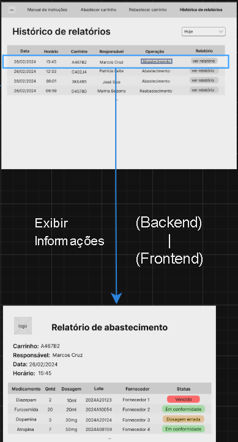

# Fluxo de João Marques

João Marques busca a capacidade de acessar o histórico dos produtos utilizados na montagem de carrinhos de emergência, possibilitando o acesso a relatórios completos sobre esses produtos específicos.

# 1. Início

Na primeira parte do fluxo João Marques utilizará o notebook disponível para abrir a tela inicial da solução web. Nela, há quatro opções disponíveis através de botões: `Abastecimento`, `Reabastecimento`, `Manual` e `Histórico de relatórios`, porém somente interessa à João Marques dois desses botões, sendo eles `Manual` e `Histórico de relatório`.

# 2. Histórico de Relatórios

Ao explorar esta seção, João Marques terá acesso a uma ampla gama de relatórios gerados a partir da leitura de nosso robô. Ele terá a liberdade de escolher qualquer relatório em qualquer momento, cada um apresentando seus próprios conjuntos de dados detalhados e relevantes.Para selecionar o relatório que desejar, basta clicar em `Ver Relatório`.

# 3. Detalhes do Relatório

Ao acessar um dos relatórios, João Marques é apresentado a uma ampla gama de informações detalhadas, incluindo dados essenciais como o `Medicamento`, `Quantidade`, `Dosagem`, `Lote`, `Fornecedor` e `Status`. Esses elementos fornecem a ele uma visão abrangente e precisa do histórico dos produtos utilizados na montagem dos carrinhos de emergência, permitindo uma gestão eficiente e informada dos recursos médicos disponíveis.

# 4. Resumo

O fluxo de João Marques envolve a busca pela capacidade de acessar o histórico dos produtos utilizados na montagem de carrinhos de emergência, permitindo o acesso a relatórios completos sobre esses produtos específicos. Inicialmente, ele utiliza o notebook disponível para acessar a tela inicial da solução web, onde seleciona a seção `Histórico de Relatórios`. Nesta seção, João Marques tem acesso a uma variedade de relatórios gerados pelo sistema, cada um contendo dados detalhados e relevantes sobre os produtos utilizados. Ao selecionar um relatório específico, ele é apresentado a informações detalhadas, incluindo o nome do medicamento, quantidade, dosagem, número de lote, fornecedor e estado atual. Isso proporciona a João Marques uma visão abrangente e precisa do histórico de produtos, permitindo uma gestão eficiente e informada dos recursos médicos disponíveis.

Segue imagem completa do Fluxo:

Link do Mapa de Fluxo de João Marques está [aqui.](https://app.diagrams.net/#G1CRC3x92H1E8TorkcSLv8vaKYQS63eDBr#%7B%22pageId%22%3A%222YBvvXClWsGukQMizWep%22%7D)