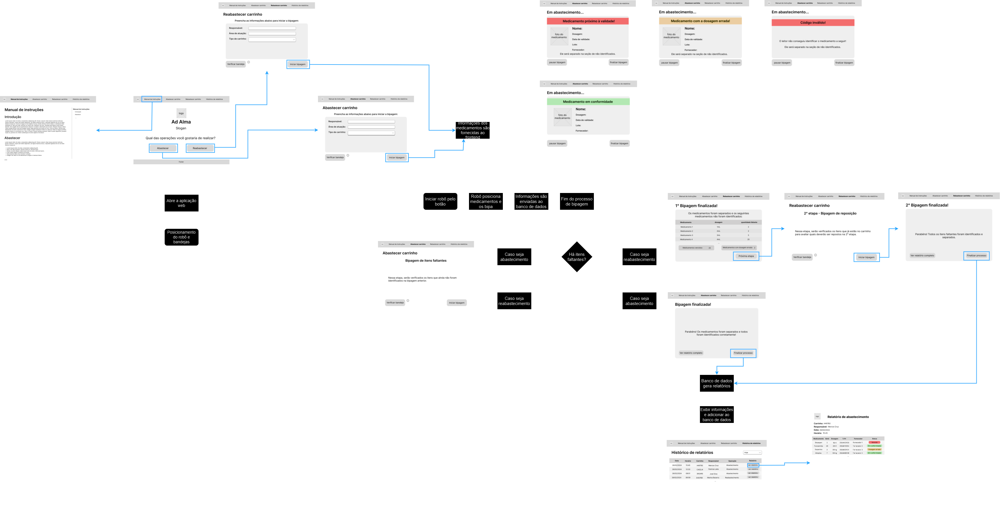

#  Fluxo de usuário

O mapa de fluxo de usuário foi criado para facilitar a compreensão do funcionamento da solução web, da jornada e comportamento do usuário, mostrando as possíveis telas que o usuário pode acessar e as situações que podem ocorrer durante o uso da solução. O mapa foi dividido em três partes, cada uma representando uma etapa do fluxo de uso da solução web.

## 1. Início

Na primeira parte do fluxo o auxiliar de emergência, após o posicionamento do robô automatizado e da bandeja que dispõe dos medicamentos, utilizará o notebook disponível no momento para abrir a tela inicial da solução web. Nela, há quatro opções disponíveis através de botões: `Abastecimento`, `Reabastecimento`, `Manual` e `Histórico de relatórios`, cada uma com sua respectiva tela de destino.

## 2. (Re)Abastecimento/Situação dos medicamentos

Na segunda parte do fluxo, são fornecidas informações dos medicamentos do carrinho durante o processo do abastecimento do carrinho, iniciado através do botão de "Iniciar bipagem", sendo que estes podem se encontrar nas seguintes situações: `Em conformidade`, `Próximo à validade` `Dosagem errada` e `Código inválido`. Cada uma dessas situações possui uma tela de destino, que apresenta as informações necessárias para o usuário tomar a decisão correta do medicamento em questão.

## 3. Processo de bipagem

Na terceira parte do fluxo, inicia-se o processo de bipagem dos medicamentos localizados nas bandejas. Neste mapa são apresentadas as possíveis situações após o processo de bipagem, se todos os medicamentos foram bipados corretamente ou se houve algum erro durante o processo. Cada uma dessas situações possui uma tela de destino, que apresenta as informações necessárias para o usuário tomar a decisão correta do medicamento em questão.

## 4. Resumo

Em seu fluxo, o auxiliar de emergência possui como objetivo principal realizar os processos da montagem do carrinho e bipagem dos medicamentos disponíveis, acessando todas as teals da aplicação web. Após isso, ele busca acessar os relatórios gerados pelo sistema, que contém informações detalhadas e relevantes sobre os produtos utilizados. Com isso, ele é capaz de ter uma visão abrangente e precisa do histórico de produtos, permitindo uma gestão eficiente e informada dos recursos médicos disponíveis.

Imagem completa do fluxo:

Link do Mapa de Fluxo de Utilização da Solução está [aqui.](https://drive.google.com/file/d/1b1SqF-nfEr7xEatzmeh_bXHwYnTG2G3F/view?usp=sharing)