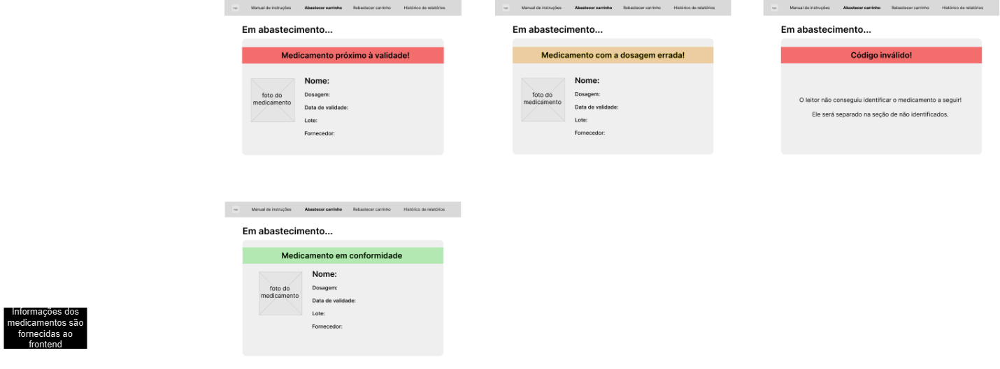

#  Fluxo de usuário

O mapa de fluxo de usuário foi criado para facilitar a compreensão do funcionamento da solução web, da jornada e comportamento do usuário, mostrando as possíveis telas que o usuário pode acessar e as situações que podem ocorrer durante o uso da solução. O mapa foi dividido em três partes, cada uma representando uma etapa do fluxo de uso da solução web.

## 1. Início

Na primeira parte do fluxo, utilizando o notebook disponível no momento, a tela inicial da solução web é apresentada ao usuário. Nela, há quatro escolhas possíveis: `Abastecimento`, `Reabastecimento`, `Manual` e `Histórico de relatórios`, cada uma com sua respectiva tela de destino.

## 2. Situação dos medicamentos

Na segunda parte do fluxo, são fornecidos informações dos medicamentos do carrinho, podendo estar em quatro situações: `Em conformidade`, `Próximo à validade` `Dosagem errada` e `Código inválido`. Cada uma dessas situações possui uma tela de destino, que apresenta as informações necessárias para o usuário tomar a decisão correta.

## 3. Processo de bipagem

Na terceira e última parte do fluxo, inicia-se o processo de bipagaem dos medicamentos do carrinho. Neste mapa são apresentados as possibilidades de situações que podem ocorrer após o processo de bipagem, caso o processo seja de abastecimento ou reabastecimento, caso haja itens faltantes e como é possível viualizar o histórico dos medicamentos bipados.

