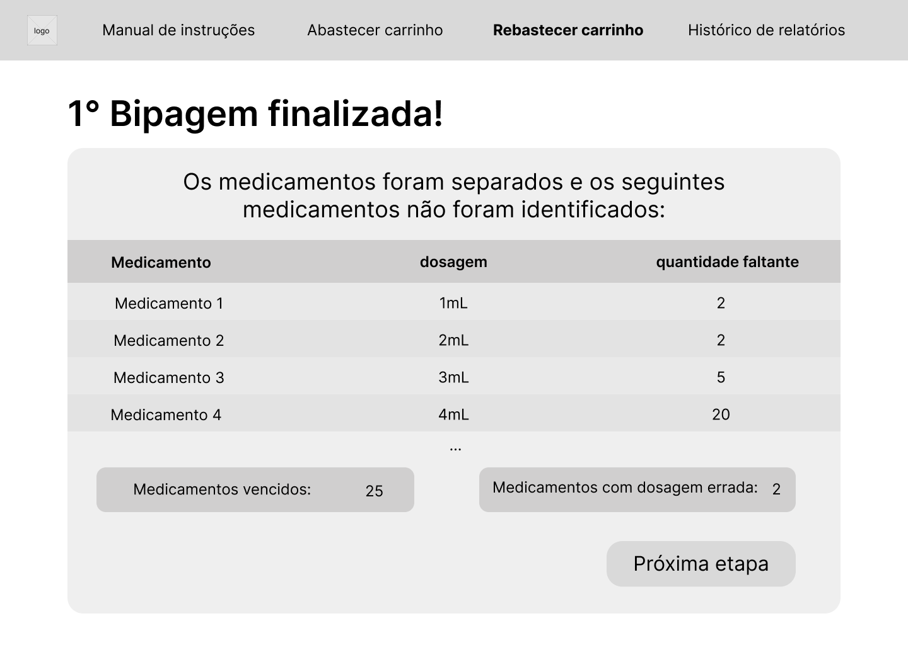

import Tabs from '@theme/Tabs';
import TabItem from '@theme/TabItem';
import styles from './styles.module.css';

# Wireframe da solução e mockup

Os wireframes são representações visuais básicas de uma interface gráfica, geralmente criados no estágio inicial do processo de design. Eles são esboços simplificados que mostram a estrutura e o layout de uma página ou aplicativo, sem se preocupar com detalhes visuais ou estilísticos, tem o foco nas funcionalidades apresentadas. Eles são importantes na criação de interfaces gráficas porque fornecem uma visão clara e organizada da estrutura e do fluxo de uma aplicação. Além disso, também ajudam os designers e desenvolvedores a visualizar e comunicar a arquitetura da informação, a disposição dos elementos e a interação entre as diferentes partes da interface, facilitando no consenso entre as ideias. Outro benefício é que os wireframes permitem que as equipes de design e desenvolvimento colaborem de forma eficiente, pois podem ser rapidamente iterados e ajustados antes de iniciar a implementação do design final.

Já o mockup é uma representação visual mais detalhada e próxima do design final de uma interface gráfica. Ao contrário do wireframe, o mockup leva em consideração os aspectos visuais, como cores, tipografia, imagens e estilos, proporcionando uma visualização mais realista do produto final.

A principal diferença entre o wireframe e o mockup é o nível de detalhamento. Enquanto o wireframe é mais simples e focado na estrutura e layout, o mockup vai além, mostrando como os elementos visuais serão apresentados e interagirão na interface.

Com base nesse propósito, foram criadas as seguintes telas em wireframe e posteriormente em mockup como explicado abaixo: 

<Tabs>
    <TabItem value="Tela inicial" label="Tela Inicial" default>
    ## Tela Incial
    
    A partir dessa tela inicial, podemos observar que ela apresenta as funcionalidades da plataforma na barra de navegação, mas também traz botões no centro da tela que redirecionam para os fluxos mais utilizados, no caso o processo de abastecimento dos carrinhos. A partir do wireframe com a apresentação da plataforma e das funções, buscamos trazer algo mais direto e simples no mockup, mantendo a identidade visual do Alma e melhorando a usabilidade com acesso rápido às funções mais usadas.
    
    </TabItem>
    <TabItem value="Manual de instruções" label="Manual de instruções" >
    ## Manual de instruções
    
    A tela de manual de instruções tem como objetivo mostrar de forma clara e interativa como operar as principais funcionalidades da plataforma e também como lidar com processos do robô, desde pré configurações até casos de erro e manutenção. Essa página segue o padrão de documentações listadas por tópicos, mas é possível acessar o tópico desejado com o sumário na parte direita.
    
    </TabItem>
    <TabItem value="Abastecimento" label="Abastecimento">
    ## Abastecimento de medicamentos
    
    Nessa tela, é necessário inserir as informações para iniciar o processo de abastecimento, de modo a registrar no relatório informações como responsável pela operação e o tipo de carrinho, além de configurar para saber quais serão os medicamentos a serem identificados. Em relação ao mockup, é necessário primeiramente clicar em "verificar bandeja" para prosseguir, uma vez que é necessário mapear para saber se todos os elementos da bipagem estão no alcance do braço robótico.
    
    
    ### Bipagem
    Assim, ao prosseguir, o processo de bipagem inicia e são possíveis 4 cenários de identificação dos medicamentos, como explicado abaixo:
    <Tabs>
        <TabItem value="em conformidade" label="Em conformidade" attributes={{className: styles.green}}>
            
            Nessa caso, o código foi identificado pelo sensor e o medicamento está em conformidade com o esperado, portanto, ele é colocado no local correto e passa para o próximo medicamento.
            
        </TabItem>
        <TabItem value="Dosagem errada" label="Dosagem errada" attributes={{className: styles.yellow}}>
            
            Nessa tela, é exibido o medicamento identificado, mas aparenta estar com a dosagem errada do esperado, portanto, ele é separado em uma bandeja para posterior envio ao estoque.
            
        </TabItem>
        <TabItem value="Próximo à validade" label="Próximo à validade" attributes={{className: styles.red}}>
            
            Nessa tela, é possível identificar a irregularidade como vencido a partir do lote e da data de validade identificadas do medicamento, sendo destinado, então, para a bandeja de medicamentos a serem descartados.
            
        </TabItem>
        <TabItem value="Código inválido" label="Código inválido" attributes={{className: styles.red}}>
            
            Essa tela é exibida quando o sensor não consegue identificar o código do medicamento ou o código não esstá registrado no sistema, sendo assim separado em uma outra bandeja para posterior destinação.
            
        </TabItem>
    </Tabs>
        ### Medicamentos faltantes
        A partir dessa etapa de bipagem, caso não exista mais medicamentos a serem identificados ou o supervisor finalize a bipagem a partir do botão de finalizar, ele é direcionado para a tela abaixo, a partir da condição de como ocorreu a reposição dos medicamentos, ou seja, caso haja medicamentos faltantes ou não:
        <Tabs>
            <TabItem value="Bipagem finalizada" label="Não há medicamentos faltantes">
                
                Assim que a bipagem for finalizada, essa tela será exibida e o botão de finalizar processo retorna à tela inicial.
                
            </TabItem>
            <TabItem value="Bipagem não finalizada" label="Há medicamentos faltantes">
            
            Caso haja medicamentos faltantes, esses medicamentos serão indicados na tela e o usuário poderá ver o relatório completo para avaliar todo o processo ou prosseguir com outra etapa de bipagem, a fim de repor os medicamentos faltantes. Caso o usuário clique em reabastecer itens faltantes, ele seguirá com o mesmo fluxo de bipagem, até que encerre na tela de bipagem finalizada.
            
            </TabItem>
        </Tabs>
    </TabItem>
    <TabItem value="Reabastecimento" label="Reabastecimento">
    ## Reabastecimento de medicamentos
    
    
    
    Nessa tela, é necessário inserir as informações para iniciar o processo de reabastecimento, de modo a registrar no relatório informações como responsável pela operação e o tipo de carrinho a ser reabastecido, além de configurar para saber quais serão os medicamentos a serem identificados. Após essa tela, dando prosseguimento ao fluxo, a 1° etapa ocorre no mesmo esquema que a de abastecimento, com a verificação da posição da bandeja como requisito para iniciar a bipagem, mas nesse caso, ele confere os medicamentos que já estão no carrinho em vez de inseri-los no carrinho. Nesse caso, o wireframe e o mockup se diferem devido a alterações após o processo do wireframe ser desenvolvido.  
    ### 1° etapa - Bipagem de itens no carrinho
    Ao iniciar a bipagem, assim como no abastecimento, os medicamentos podem ser identificados a partir de 4 rótulos: **em conformidade**, **dosagem errada**, **Próximo à validade** e **código inválido**.  
    <Tabs>
        <TabItem value="em conformidade" label="Em conformidade" attributes={{className: styles.green}}>
            
            Nessa caso, o código foi identificado pelo sensor e o medicamento está em conformidade com o esperado, portanto, ele é colocado no local correto e passa para o próximo medicamento.
            
        </TabItem>
        <TabItem value="Dosagem errada" label="Dosagem errada" attributes={{className: styles.yellow}}>
            
            Nessa tela, é exibido o medicamento identificado, mas aparenta estar com a dosagem errada do esperado, portanto, ele é separado em uma bandeja para posterior envio ao estoque.
            
        </TabItem>
        <TabItem value="Próximo à validade" label="Próximo à validade" attributes={{className: styles.red}}>
            
            Nessa tela, é possível identificar a irregularidade como vencido a partir do lote e da data de validade identificadas do medicamento, sendo destinado, então, para a bandeja de medicamentos a serem descartados.
            
        </TabItem>
        <TabItem value="Código inválido" label="Código inválido" attributes={{className: styles.red}}>
            
            Essa tela é exibida quando o sensor não consegue identificar o código do medicamento ou o código não esstá registrado no sistema, sendo assim separado em uma outra bandeja para posterior destinação.
            
        </TabItem>
    </Tabs>
        ### 2° etapa - Reposição de itens
        A partir da 1° etapa de bipagem, a tela exibida será da relação de itens faltantes no carrinho, encontrados a partir da listagem do que deveria estar no carrinho versus o que foi identificado.
        
        
        A partir dessa etapa, é esperado que o usuário separe os medicamentos faltantes e inicia a segunda etapa, a de reposição:
        
        
        Após a 2° bipagem, a identificação dos medicamentos ocorre da mesma forma que a 1° etapa, com os rótulos: **em conformidade**, **dosagem errada**, **Próximo à validade** e **código inválido**. 
        Assim, se houver alguma irregularidade, o sistema encaminhará para a tela de reposição de itens faltantes até que todos os itens necessários do carrinho sejam repostos, indicando etapa finalizada.
        <Tabs>
            <TabItem value="Bipagem finalizada" label="Não há medicamentos faltantes">
                
                Assim que a bipagem for finalizada, essa tela será exibida e o botão de finalizar processo retorna à tela inicial.
                
            </TabItem>
            <TabItem value="Bipagem não finalizada" label="Há medicamentos faltantes">
            
            Caso haja medicamentos faltantes, esses medicamentos serão indicados na tela e o usuário poderá ver o relatório completo para avaliar todo o processo ou prosseguir com outra etapa de bipagem, a fim de repor os medicamentos faltantes. Caso o usuário clique em reabastecer itens faltantes, ele seguirá com o mesmo fluxo de bipagem, até que encerre na tela de bipagem finalizada.
            
            </TabItem>
        </Tabs>
    </TabItem>
    <TabItem value="Histórico de relatórios" label="Histórico de relatórios">
    Ao clicar no item de Histórico de relatórios na barra de navegação, o usuário é redirecionado a essa tela com a lista cronológica dos relatórios gerados a partir do abastecimento e reabastecimento de carrinhos:  
    
    
      
    Ao clicar em exibir pdf, uma tela com o PDF do relatório específico será exibido com informações detalhes sobre o processo, o responsável, a data e informações sobre cada medicamento identificado.  
    
    </TabItem>
</Tabs>

Portanto, espera que a partir da prototipação produzida, o desenvolvimento da solução final se torne mais claro e iterativo, aproximando o cliente da solução esperada a partir da representação simplificada com wireframes e o detalhamento a partir de mockups.
