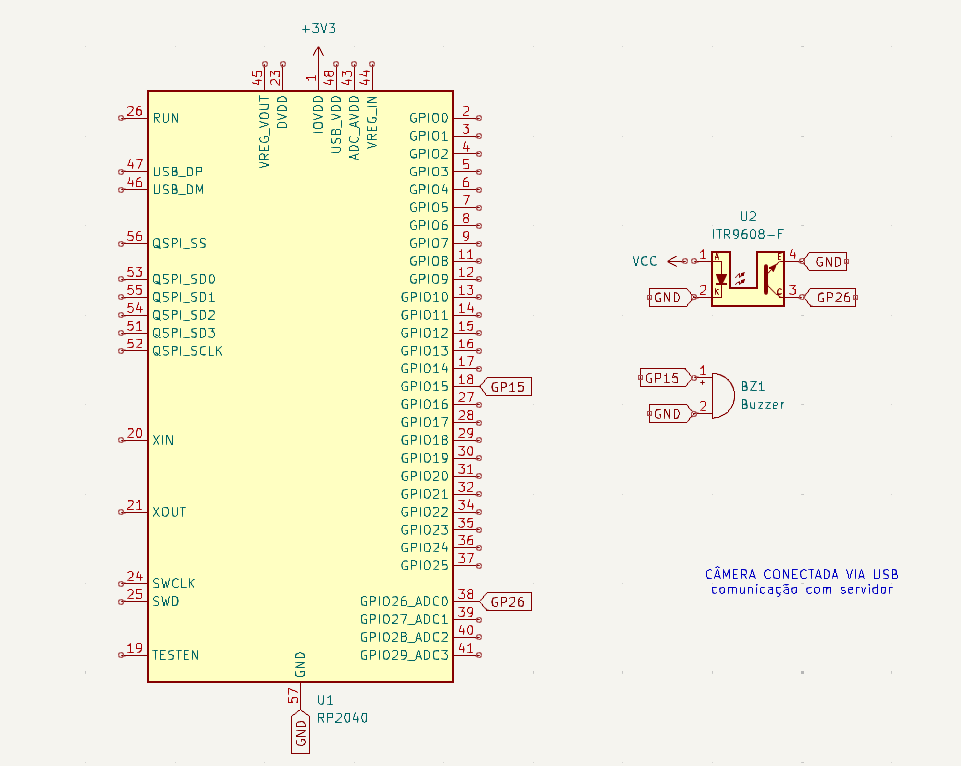
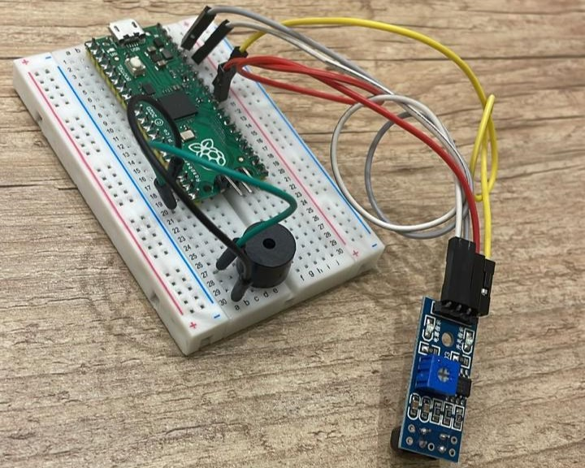
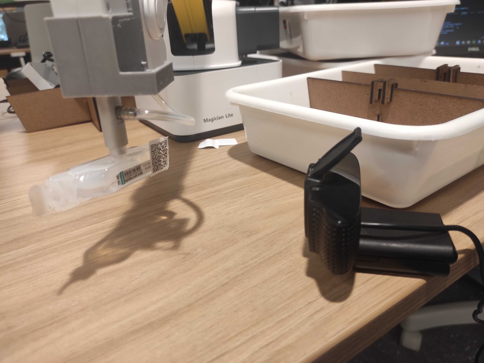

# Hardware Periférico

No decorrer da Sprint 3, o desenvolvimento concentrou-se na implementação e no aperfeiçoamento do hardware periférico de nossa solução robótica. Com o objetivo de aumentar a rastreabilidade e assegurar a integridade do processo, implementamos uma série de sensores e câmeras, todos gerenciados por um circuito com microcontrolador integrado, otimizando as funcionalidades do robô.

Os avanços alcançados abrangem várias áreas, detalhadas a seguir: um diagrama explicativo do hardware periférico, a implementação de um sensor infravermelho, a integração de uma câmera com capacidade de reconhecimento de QR Codes, e, por fim, a efetiva integração desses componentes ao sistema do robô.

## Diagrama do Hardware Periférico

O diagrama acima ilustra a configuração do hardware periférico, incluindo o sensor infravermelho conectado ao microcontrolador, que, por sua vez, está vinculado a um buzzer, formando um sistema integrado de alerta e detecção.

### Materiais Utilizados:
- Raspberry Pi Pico W - atuando como o microcontrolador RP2040;
- Módulo sensor infravermelho TCRT5000 - representado como ITR9608-F;
- Buzzer;
- Protoboard;
- Fios de conexão (jumpers).

### Guia de Montagem:
1. **Alimentação do Módulo TCRT5000:**
   - **VCC para 3.3V:** Conectar o pino VCC do TCRT5000 a um pino de 3.3V do Pico W.
   - **GND para GND:** Interligar o GND do módulo ao GND do Pico W, garantindo a correta referência de terra.

2. **Saída do Módulo TCRT5000:**
   - **Saída Analógica (AO):** Ligada ao pino GP26 do microcontrolador.

3. **Conexão do Buzzer:**
   - **Buzzer ao GP15:** Um terminal do buzzer conectado ao pino GP15 do Pico W.
   - **Buzzer ao GND:** O outro terminal conectado ao GND.

[Link para download dos arquivos do projeto.](https://drive.google.com/drive/folders/1KePuMLv8DWsRA4y9oFspp2WJk1aRgLx7?usp=sharing)

## Sensor Infravermelho

A imagem acima exibe o circuito montado com o sensor infravermelho, um componente chave para a detecção da presença de medicamentos pelo robô. Posicionado estrategicamente, ele emite um sinal sonoro através do buzzer quando um medicamento é detectado, fornecendo um meio eficaz de confirmar a correta aquisição dos itens.

## Câmera com Reconhecimento de QR Codes

A incorporação da câmera ao sistema do robô representa um avanço significativo, permitindo a identificação precisa dos medicamentos através de QR Codes. Esse processo reforça a rastreabilidade e aumenta a segurança operacional, ao assegurar a correta seleção e validade dos medicamentos.

A câmera, estrategicamente posicionada, facilita a bipagem dos medicamentos, agilizando o processo de montagem dos carrinhos e contribuindo para a eficiência geral do sistema.

## Integração com o Robô

A fase de integração testemunhou a harmonização dos componentes de hardware periférico com o sistema central do robô, marcando um ponto crucial no desenvolvimento do projeto. A sincronização entre os sensores, a câmera e o microcontrolador possibilitou a automatização de tarefas previamente manuais, como a detecção de medicamentos e a verificação de suas informações via QR Codes.

Este avanço permitiu uma operação mais autônoma e confiável do robô, aumentando a precisão das atividades realizadas e reduzindo significativamente a

## Conclusão

A implementação e aprimoramento do hardware periférico no decorrer da Sprint 3 representam marcos significativos no desenvolvimento da nossa solução robótica. Através da integração de sensores infravermelhos e câmeras com capacidade de reconhecimento de QR Codes, além da orquestração eficiente desses componentes com um microcontrolador avançado, conseguimos estabelecer um sistema robusto, confiável e altamente funcional.

Este sistema não apenas aumenta a rastreabilidade e segurança do processo como também promove uma maior eficiência operacional, evidenciando o potencial da automação inteligente na otimização de tarefas críticas. A precisão na detecção e identificação de medicamentos, aliada à capacidade de integração e sincronização entre os componentes do hardware, pavimenta o caminho para inovações futuras que podem transformar significativamente o campo da robótica aplicada à saúde.

Olhando para o futuro, o projeto se encontra bem posicionado para expandir suas funcionalidades e explorar novas aplicações, mantendo o compromisso com a melhoria contínua e a busca por soluções que atendam às necessidades emergentes do setor. A equipe permanece motivada e dedicada a avançar na fronteira da tecnologia, visando sempre a excelência e a eficácia em suas soluções.

Portanto, concluímos esta fase do projeto não apenas com a satisfação dos resultados alcançados, mas também com a antecipação entusiasmada das oportunidades que esses avanços nos proporcionarão. Continuaremos a explorar, a inovar e a implementar, com o objetivo de elevar ainda mais o padrão de segurança e eficiência na manipulação e administração de medicamentos através de soluções robóticas avançadas.
