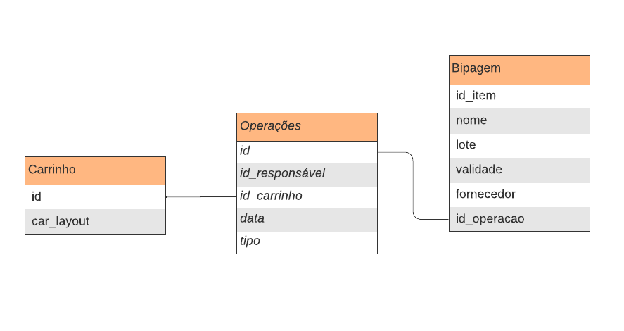

Para sustentar o projeto e as requisções que serão feitas na aplicação, o grupo montou uma estrutura de banco ed dados relacional, que tem como objetivo guardar informações importantes pertencentes ao fluxo de utilização.
O esquema do banco pode ser acompanhada a seguir:

A partir dessa estrutura, é viável adicionar os carrinhos já existentes e monitorar todos os dados relativos aos itens e às operações. Isso é crucial para os relatórios que serão elaborados posteriormente e para as ações executadas pelo robô.

## Rotas

Além do desenvolvimento do banco de dados, foram implementadas as primeiras rotas que são essenciais para a aplicação, principalmente ao integrar à lógica de programação da aplicação.
Essas funcionalidades de rota incluem o método `GET` para cada tabela, que retorna todos os registros específicos de cada tabela, e o método `POST`, que permite a adição de novos registros em cada tabela existente.
