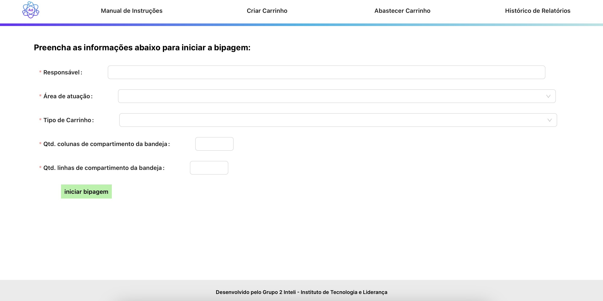

# Contexto

O principal trabalho executado em torno da Sprint 4 foi a integração do frontend e backend. Em outras palavras, fazer com que a nossa aplicação web busque dados no banco de dados e mostre-os pela interface ou, também, faça movimentos no robô por input do usuário.

Para explicar essa tarefa importante, iremos comentar sobre o backend, o algoritmo e a integração.

# Backend

Nosso serviço de backend fornece rotas para fazer requisições HTTPs para enviar/obter dados no banco de dados ou movimentar o robô.

## Detalhamento das Rotas do Backend

O backend da nossa aplicação é estruturado em torno do FastAPI, um framework moderno, rápido (de alta performance) para construção de APIs com Python 3.7+. Abaixo estão detalhadas as rotas disponíveis, suas funções e como interagem com o banco de dados SQLite.

### Bipagem

#### Obter todas as bipagens (`GET /bipagem/`)

Esta rota retorna uma lista de todas as bipagens registradas no banco de dados. Uma bipagem refere-se a uma operação de registro de um item, contendo informações como ID do item, nome, lote, validade, fornecedor, e a operação à qual está vinculada.

#### Adicionar nova bipagem (`POST /adicionar_bipagem/`)

Permite a inserção de uma nova bipagem no banco de dados. Os dados necessários para o registro incluem o ID do item, nome, lote, validade, fornecedor, e o ID da operação relacionada. Esta rota é crucial para registrar novos itens no sistema, vinculando-os às suas respectivas operações.

### Operações

#### Obter todas as operações (`GET /operacoes/`)

Fornece uma lista de todas as operações registradas, que são ações realizadas ou a serem realizadas dentro do sistema. Uma operação é caracterizada por seu próprio ID, ID do responsável, ID do carrinho envolvido, data e tipo (por exemplo, entrada ou saída de itens).

#### Adicionar nova operação (`POST /adicionar_operacao/`)

Esta rota permite adicionar uma nova operação ao banco de dados, detalhando informações como ID da operação, data, ID do responsável, ID do carrinho utilizado, e o tipo de operação. Isso facilita o rastreamento de atividades e a associação com itens específicos e carrinhos.

### Carrinhos

#### Obter todos os carrinhos (`GET /carrinhos/`)

Retorna uma lista com todos os carrinhos registrados no sistema. Um carrinho é identificado por seu ID e layout (car_layout), que pode indicar sua configuração ou capacidade.

#### Adicionar novo carrinho (`POST /adicionar_carrinho/`)

Permite a inclusão de um novo carrinho no sistema, fornecendo seu ID e o layout. Esta rota é essencial para ampliar a capacidade operacional, permitindo a inclusão de novos carrinhos conforme necessário.

## Considerações Adicionais

- Cada rota desempenha um papel fundamental na interação entre o frontend e o backend, permitindo não apenas a visualização dos dados mas também a inserção de novas informações no sistema.
- As rotas de adição (`POST`) são especialmente importantes para a expansão e atualização do banco de dados, refletindo as ações dos usuários no sistema.
- É crucial que as requisições ao backend sigam o formato especificado para cada rota, garantindo a correta comunicação e funcionamento da aplicação.

# Algoritmo de Mapeamento

*Figura 1: Ilustração do Algoritmo de Mapeamento.*

Estamos orgulhosos em dizer que, ao longo da Sprint 4, implementamos um algoritmo de mapeamento para as bandejas onde estarão os medicamentos. Esta inovação em nosso projeto surge com a pergunta a partir do seguinte problema: E se o layout das bandejas mudarem? E se for maior? Menor? Com isso, fica inviável do robô saber a posição dos medicamentos. 

Logo, em nosso algoritmo, ao receber dois valores de entrada (número de compartimentos por coluna e número de compartimentos por linha), o robô sabe exatamente a posição em que deve fazer para buscar os medicamentos. O usuário insere o layout cadastrado (seja 2x2, 4x2, 4x3) e a operação é realizada. 

# Integração

*Figura 2: Tela de Criar Carrinho e Iniciar Bipagem.*

Para que o usuário consiga movimentar o robô pela interface web, visualizar dados e inserir dados, precisamos integrar o frontend com o backend. Dito isso, nesta sprint, é possível começar o processo de bipagem pela plataforma. Na página de criar carrinho, o usuário preenche seus dados, escolhe o layout e clicar em "iniciar bipagem". 

Ao clicar nesse botão, é feito uma requisição do tipo get no backend para mover o robô. 

# Em progresso...

Entendemos que ainda há muito a se integrar, por isso, gostaríamos de deixar aqui o que será feito na Sprint 5 no quesito integração do frontend e backend:

* Enviar dados para o banco de dados ao criar carrinho:
    * Executar a movimentação do robô de acordo com os dados enviados.

* Mostrar bipagens em andamento de acordo com movimento do robô. 

* Requisição do banco de dados para mostrar a página de relatórios:
    * Get com os dados dos carrinhos abastecidos;
    * Get com os dados das bipagens de cada medicamento.
