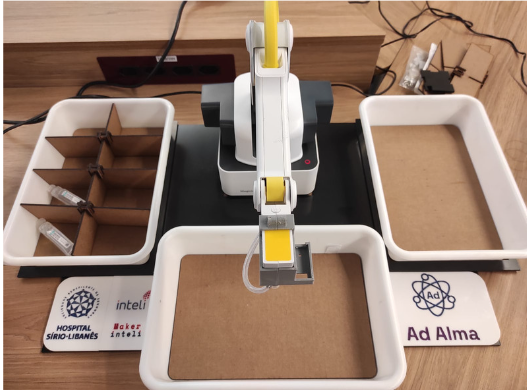
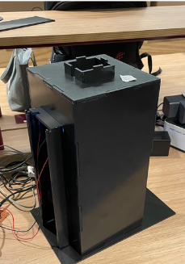
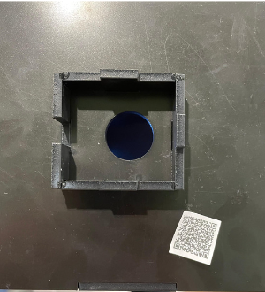

Ao avançar no desenvolvimento da nossa solução, o grupo deparou-se com desafios relacionados à precisão e eficácia dos processos físicos do robô. Durante a execução das tarefas de movimentação e bipagem, identificamos inconsistências que, se não fossem tratadas, poderiam comprometer significativamente a performance do sistema. Para enfrentar esses desafios e otimizar a operação do robô, decidimos incorporar componentes físicos auxiliares. Esses componentes foram projetados para maximizar o controle sobre o processo, minimizando interferências e potencializando a eficiência da solução.

A seguir, apresentamos uma descrição detalhada dessas inovações e como elas contribuem para a melhoria do sistema:

## Base para Robô e Bandejas

Uma das adversidades enfrentadas durante o processo de desenvolvimento foi a constante necessidade de reajustar as bandejas para alinhá-las adequadamente com os pontos de atuação do robô. Essa situação não só consumia tempo valioso como também elevava o risco de erros operacionais, afetando a confiabilidade do sistema.

Para resolver esse impasse, o grupo projetou e implementou uma base de acrílico sob medida. Essa base serve para posicionar tanto o robô quanto as bandejas de maneira precisa, assegurando que todos os elementos permaneçam fixos em suas posições ideais. O design inteligente da base proporciona uma melhoria significativa no controle do processo, otimizando a execução das tarefas pelo robô. Abaixo, é possível visualizar a estrutura dessa base:

## Câmara Escura para Leitura de QR Code

Os testes iniciais de bipagem e leitura de QR Code revelaram desafios associados à iluminação e ao posicionamento dos códigos. A variação na luminosidade e a distância inconsistente entre o QR Code e a câmera resultavam em leituras falhas ou ineficientes.

Visando superar essas dificuldades, desenvolvemos uma câmara escura especialmente projetada para estabilizar as condições de iluminação e posicionamento durante a leitura dos QR Codes. Esta câmara, equipada com uma entrada ajustada para a movimentação do robô, incorpora uma câmera estrategicamente localizada em sua parte superior. Além disso, conta com a instalação de dois LEDs de alto brilho na parte traseira, garantindo uma iluminação constante e eliminando sombras que poderiam interferir na leitura. A configuração da câmara escura possibilita uma precisão e velocidade superiores na identificação dos QR Codes, conforme ilustrado nas imagens abaixo:

Essas melhorias representam passos importantes na evolução do nosso projeto, refinando a interação física do robô com seu ambiente e com os itens manipulados. Por meio desses aprimoramentos, garantimos uma maior confiabilidade e eficiência.
