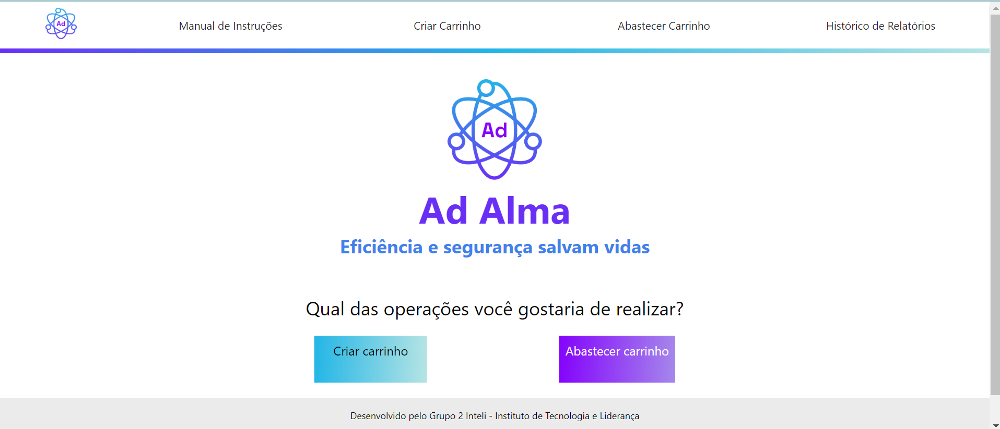
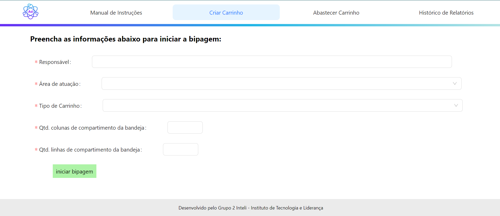

## Atualização do frontend

### Introdução

O frontend do projeto Ad Alma foi desenvolvido com o intuito de fornecer uma interface amigável e intuitiva para os usuários do sistema. Através dele, é possível realizar a criação de um carrinho e o abastecimento de carrinhos já utilizados, visualizar o histórico de relatórios gerados a partir de cada operação realizada. Além disso, também há um manual de ajuda para utilização da plataforma e de configurações do robô.

Em relação ao desenvolvimento da interface, foi utilizado o framework React, que é uma biblioteca JavaScript de código aberto com foco em criar interfaces de usuário em páginas web. O motivo de se utilizar React foi devido a sua facilidade de uso e a sua capacidade de criar interfaces de usuário de forma rápida e eficiente. Além disso, o React é uma ferramenta muito poderosa para a criação de aplicações web, pois permite a criação de componentes reutilizáveis, o que facilita a manutenção e a escalabilidade do projeto. Partindo desses benefícios, criamos os componentes que seriam utilizados em cada tela com base na prototipação feita durante a sprint 2, conforme detalhado nessa [seção](../Sprint%202/wireframe_e_telas.mdx).

### Desenvolvimento

Durante a sprint 4, o frontend passou por diversas atualizações, principalmente focando no processo de criação de carrinho:

- **Criação de componentes reutilizáveis**: Com o intuito de facilitar a manutenção e a escalabilidade do projeto, foram criados diversos componentes reutilizáveis, como botões, menus, tabelas, entre outros. Esses componentes foram utilizados em diversas telas do sistema, o que facilitou o desenvolvimento e a manutenção do frontend.

Exemplo de um componente reutilizável:

- **Tela inicial**: A tela inicial do sistema foi construida a partir do menu superior que contém as opções de navegação do sistema. Além disso, foram adicionados botões para a criação de um novo carrinho e para o abastecimento de um carrinho já utilizado.

- **Criação de carrinho**: A tela de criação de carrinho foi desenvolvida com o intuito de facilitar o processo de criação de um novo carrinho. Nessa tela, o usuário pode adicionar o responsável pela operação, a área de atuação do carrinho e escolher o layout de preenchimento. A partir dessa tela, o processo de bipagem inicia e o sistema irá modificar o card do medicamento apresentado conforme os bips são realizados.

Em relação ao sistema de rotas utilizado no frontend, foi utilizado o React Router, que é uma biblioteca que permite a navegação entre diferentes componentes React. Com o React Router, é possível criar rotas para cada componente do sistema, o que facilita a navegação entre as telas do sistema. Além disso, o React Router também permite a passagem de parâmetros entre as rotas, o que é muito útil para a criação de páginas dinâmicas.

A partir das rotas desenvolvidas e das telas criadas, a integração com o backend foi facilitada e está em andamento, com objetivo de ser finalizado na sprint 5.

### Conclusão

Portanto, o frontend do projeto Ad Alma passou por diversas atualizações durante a sprint 4, principalmente focando no processo de criação de carrinho. Através do desenvolvimento de componentes reutilizáveis e da utilização do React Router, foi possível criar uma interface amigável e intuitiva para os usuários do sistema. . Com isso, espera-se que o frontend do projeto Ad Alma seja finalizado com sucesso e que possa atender às necessidades dos usuários do sistema.